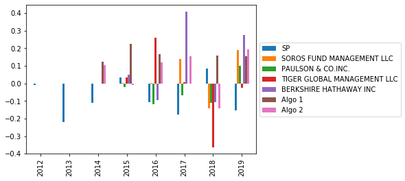
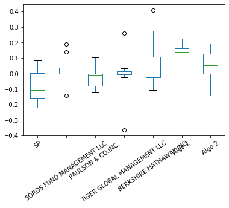
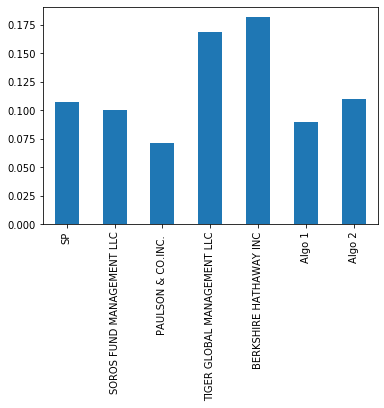
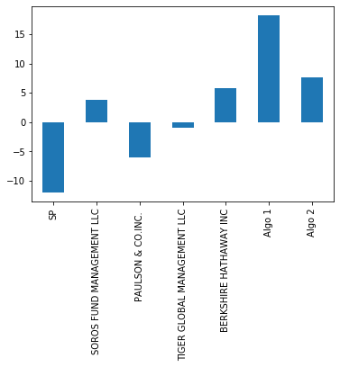
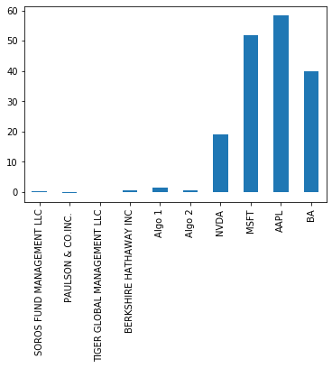

```python
# Import libraries and dependencies
import pandas as pd
from pathlib import Path
import numpy as np
%matplotlib inline
```


```python
# Reading and cleaning data
whale_returns = Path('Desktop/Resources/whale_returns.csv')
w_df = pd.read_csv(whale_returns, index_col="Date", parse_dates=True, infer_datetime_format=True)
```


```python
w_df.head(5)
```


<div>
<style scoped>
    .dataframe tbody tr th:only-of-type {
        vertical-align: middle;
    }

    .dataframe tbody tr th {
        vertical-align: top;
    }

    .dataframe thead th {
        text-align: right;
    }
</style>
<table border="1" class="dataframe">
  <thead>
    <tr style="text-align: right;">
      <th></th>
      <th>SOROS FUND MANAGEMENT LLC</th>
      <th>PAULSON &amp; CO.INC.</th>
      <th>TIGER GLOBAL MANAGEMENT LLC</th>
      <th>BERKSHIRE HATHAWAY INC</th>
    </tr>
    <tr>
      <th>Date</th>
      <th></th>
      <th></th>
      <th></th>
      <th></th>
    </tr>
  </thead>
  <tbody>
    <tr>
      <th>2015-03-02</th>
      <td>NaN</td>
      <td>NaN</td>
      <td>NaN</td>
      <td>NaN</td>
    </tr>
    <tr>
      <th>2015-03-03</th>
      <td>-0.001266</td>
      <td>-0.004981</td>
      <td>-0.000496</td>
      <td>-0.006569</td>
    </tr>
    <tr>
      <th>2015-03-04</th>
      <td>0.002230</td>
      <td>0.003241</td>
      <td>-0.002534</td>
      <td>0.004213</td>
    </tr>
    <tr>
      <th>2015-03-05</th>
      <td>0.004016</td>
      <td>0.004076</td>
      <td>0.002355</td>
      <td>0.006726</td>
    </tr>
    <tr>
      <th>2015-03-06</th>
      <td>-0.007905</td>
      <td>-0.003574</td>
      <td>-0.008481</td>
      <td>-0.013098</td>
    </tr>
  </tbody>
</table>
</div>


```python
w_df.dropna()
```


<div>
<style scoped>
    .dataframe tbody tr th:only-of-type {
        vertical-align: middle;
    }

    .dataframe tbody tr th {
        vertical-align: top;
    }

    .dataframe thead th {
        text-align: right;
    }
</style>
<table border="1" class="dataframe">
  <thead>
    <tr style="text-align: right;">
      <th></th>
      <th>SOROS FUND MANAGEMENT LLC</th>
      <th>PAULSON &amp; CO.INC.</th>
      <th>TIGER GLOBAL MANAGEMENT LLC</th>
      <th>BERKSHIRE HATHAWAY INC</th>
    </tr>
    <tr>
      <th>Date</th>
      <th></th>
      <th></th>
      <th></th>
      <th></th>
    </tr>
  </thead>
  <tbody>
    <tr>
      <th>2015-03-03</th>
      <td>-0.001266</td>
      <td>-0.004981</td>
      <td>-0.000496</td>
      <td>-0.006569</td>
    </tr>
    <tr>
      <th>2015-03-04</th>
      <td>0.002230</td>
      <td>0.003241</td>
      <td>-0.002534</td>
      <td>0.004213</td>
    </tr>
    <tr>
      <th>2015-03-05</th>
      <td>0.004016</td>
      <td>0.004076</td>
      <td>0.002355</td>
      <td>0.006726</td>
    </tr>
    <tr>
      <th>2015-03-06</th>
      <td>-0.007905</td>
      <td>-0.003574</td>
      <td>-0.008481</td>
      <td>-0.013098</td>
    </tr>
    <tr>
      <th>2015-03-09</th>
      <td>0.000582</td>
      <td>0.004225</td>
      <td>0.005843</td>
      <td>-0.001652</td>
    </tr>
    <tr>
      <th>...</th>
      <td>...</td>
      <td>...</td>
      <td>...</td>
      <td>...</td>
    </tr>
    <tr>
      <th>2019-04-25</th>
      <td>-0.000285</td>
      <td>-0.001291</td>
      <td>-0.005153</td>
      <td>0.004848</td>
    </tr>
    <tr>
      <th>2019-04-26</th>
      <td>0.008149</td>
      <td>0.009162</td>
      <td>0.012355</td>
      <td>0.010434</td>
    </tr>
    <tr>
      <th>2019-04-29</th>
      <td>0.001254</td>
      <td>0.002719</td>
      <td>0.006251</td>
      <td>0.005223</td>
    </tr>
    <tr>
      <th>2019-04-30</th>
      <td>-0.001295</td>
      <td>-0.002211</td>
      <td>-0.000259</td>
      <td>-0.003702</td>
    </tr>
    <tr>
      <th>2019-05-01</th>
      <td>-0.005847</td>
      <td>-0.001341</td>
      <td>-0.007936</td>
      <td>-0.007833</td>
    </tr>
  </tbody>
</table>
<p>1059 rows × 4 columns</p>
</div>


```python
algo_returns = Path('Desktop/Resources/algo_returns.csv')
a_df = pd.read_csv(algo_returns, index_col="Date", parse_dates=True, infer_datetime_format=True)
```


```python
a_df.head(5)
```


<div>
<style scoped>
    .dataframe tbody tr th:only-of-type {
        vertical-align: middle;
    }

    .dataframe tbody tr th {
        vertical-align: top;
    }

    .dataframe thead th {
        text-align: right;
    }
</style>
<table border="1" class="dataframe">
  <thead>
    <tr style="text-align: right;">
      <th></th>
      <th>Algo 1</th>
      <th>Algo 2</th>
    </tr>
    <tr>
      <th>Date</th>
      <th></th>
      <th></th>
    </tr>
  </thead>
  <tbody>
    <tr>
      <th>2014-05-28</th>
      <td>0.001745</td>
      <td>NaN</td>
    </tr>
    <tr>
      <th>2014-05-29</th>
      <td>0.003978</td>
      <td>NaN</td>
    </tr>
    <tr>
      <th>2014-05-30</th>
      <td>0.004464</td>
      <td>NaN</td>
    </tr>
    <tr>
      <th>2014-06-02</th>
      <td>0.005692</td>
      <td>NaN</td>
    </tr>
    <tr>
      <th>2014-06-03</th>
      <td>0.005292</td>
      <td>NaN</td>
    </tr>
  </tbody>
</table>
</div>


```python
a_df.dropna()
```


<div>
<style scoped>
    .dataframe tbody tr th:only-of-type {
        vertical-align: middle;
    }

    .dataframe tbody tr th {
        vertical-align: top;
    }

    .dataframe thead th {
        text-align: right;
    }
</style>
<table border="1" class="dataframe">
  <thead>
    <tr style="text-align: right;">
      <th></th>
      <th>Algo 1</th>
      <th>Algo 2</th>
    </tr>
    <tr>
      <th>Date</th>
      <th></th>
      <th></th>
    </tr>
  </thead>
  <tbody>
    <tr>
      <th>2014-06-05</th>
      <td>0.004062</td>
      <td>0.013285</td>
    </tr>
    <tr>
      <th>2014-06-06</th>
      <td>0.001857</td>
      <td>0.008284</td>
    </tr>
    <tr>
      <th>2014-06-09</th>
      <td>-0.005012</td>
      <td>0.005668</td>
    </tr>
    <tr>
      <th>2014-06-10</th>
      <td>0.004406</td>
      <td>-0.000735</td>
    </tr>
    <tr>
      <th>2014-06-11</th>
      <td>0.004760</td>
      <td>-0.003761</td>
    </tr>
    <tr>
      <th>...</th>
      <td>...</td>
      <td>...</td>
    </tr>
    <tr>
      <th>2019-04-25</th>
      <td>0.000682</td>
      <td>-0.007247</td>
    </tr>
    <tr>
      <th>2019-04-26</th>
      <td>0.002981</td>
      <td>0.005256</td>
    </tr>
    <tr>
      <th>2019-04-29</th>
      <td>0.005208</td>
      <td>0.002829</td>
    </tr>
    <tr>
      <th>2019-04-30</th>
      <td>-0.002944</td>
      <td>-0.001570</td>
    </tr>
    <tr>
      <th>2019-05-01</th>
      <td>0.000094</td>
      <td>-0.007358</td>
    </tr>
  </tbody>
</table>
<p>1235 rows × 2 columns</p>
</div>


```python
sp_returns = Path('Desktop/Resources/sp500_history.csv')
sp_df = pd.read_csv(sp_returns, index_col="Date", parse_dates=True, infer_datetime_format=True)
```


```python
sp_df.head(5)
```


<div>
<style scoped>
    .dataframe tbody tr th:only-of-type {
        vertical-align: middle;
    }

    .dataframe tbody tr th {
        vertical-align: top;
    }

    .dataframe thead th {
        text-align: right;
    }
</style>
<table border="1" class="dataframe">
  <thead>
    <tr style="text-align: right;">
      <th></th>
      <th>Close</th>
    </tr>
    <tr>
      <th>Date</th>
      <th></th>
    </tr>
  </thead>
  <tbody>
    <tr>
      <th>2019-04-23</th>
      <td>$2933.68</td>
    </tr>
    <tr>
      <th>2019-04-22</th>
      <td>$2907.97</td>
    </tr>
    <tr>
      <th>2019-04-18</th>
      <td>$2905.03</td>
    </tr>
    <tr>
      <th>2019-04-17</th>
      <td>$2900.45</td>
    </tr>
    <tr>
      <th>2019-04-16</th>
      <td>$2907.06</td>
    </tr>
  </tbody>
</table>
</div>


```python
sp_df.dropna()
```


<div>
<style scoped>
    .dataframe tbody tr th:only-of-type {
        vertical-align: middle;
    }

    .dataframe tbody tr th {
        vertical-align: top;
    }

    .dataframe thead th {
        text-align: right;
    }
</style>
<table border="1" class="dataframe">
  <thead>
    <tr style="text-align: right;">
      <th></th>
      <th>Close</th>
    </tr>
    <tr>
      <th>Date</th>
      <th></th>
    </tr>
  </thead>
  <tbody>
    <tr>
      <th>2019-04-23</th>
      <td>$2933.68</td>
    </tr>
    <tr>
      <th>2019-04-22</th>
      <td>$2907.97</td>
    </tr>
    <tr>
      <th>2019-04-18</th>
      <td>$2905.03</td>
    </tr>
    <tr>
      <th>2019-04-17</th>
      <td>$2900.45</td>
    </tr>
    <tr>
      <th>2019-04-16</th>
      <td>$2907.06</td>
    </tr>
    <tr>
      <th>...</th>
      <td>...</td>
    </tr>
    <tr>
      <th>2012-10-05</th>
      <td>$1460.93</td>
    </tr>
    <tr>
      <th>2012-10-04</th>
      <td>$1461.40</td>
    </tr>
    <tr>
      <th>2012-10-03</th>
      <td>$1450.99</td>
    </tr>
    <tr>
      <th>2012-10-02</th>
      <td>$1445.75</td>
    </tr>
    <tr>
      <th>2012-10-01</th>
      <td>$1444.49</td>
    </tr>
  </tbody>
</table>
<p>1649 rows × 1 columns</p>
</div>


```python
sp_df.sort_index()
```


<div>
<style scoped>
    .dataframe tbody tr th:only-of-type {
        vertical-align: middle;
    }

    .dataframe tbody tr th {
        vertical-align: top;
    }

    .dataframe thead th {
        text-align: right;
    }
</style>
<table border="1" class="dataframe">
  <thead>
    <tr style="text-align: right;">
      <th></th>
      <th>Close</th>
    </tr>
    <tr>
      <th>Date</th>
      <th></th>
    </tr>
  </thead>
  <tbody>
    <tr>
      <th>2012-10-01</th>
      <td>1444.49</td>
    </tr>
    <tr>
      <th>2012-10-02</th>
      <td>1445.75</td>
    </tr>
    <tr>
      <th>2012-10-03</th>
      <td>1450.99</td>
    </tr>
    <tr>
      <th>2012-10-04</th>
      <td>1461.40</td>
    </tr>
    <tr>
      <th>2012-10-05</th>
      <td>1460.93</td>
    </tr>
    <tr>
      <th>...</th>
      <td>...</td>
    </tr>
    <tr>
      <th>2019-04-16</th>
      <td>2907.06</td>
    </tr>
    <tr>
      <th>2019-04-17</th>
      <td>2900.45</td>
    </tr>
    <tr>
      <th>2019-04-18</th>
      <td>2905.03</td>
    </tr>
    <tr>
      <th>2019-04-22</th>
      <td>2907.97</td>
    </tr>
    <tr>
      <th>2019-04-23</th>
      <td>2933.68</td>
    </tr>
  </tbody>
</table>
<p>1649 rows × 1 columns</p>
</div>


```python
sp_df.isnull().sum()
```


    Close    0
    dtype: int64


```python
sp_df['Close'] = sp_df['Close'].str.replace('$', '')
```


```python

```


```python
sp_df.columns
```


    Index(['Close'], dtype='object')


```python
sp_daily = sp_df['Close'].astype(float).pct_change(1)
```


```python
sp_daily.dropna()
```


    Date
    2019-04-22   -0.008764
    2019-04-18   -0.001011
    2019-04-17   -0.001577
    2019-04-16    0.002279
    2019-04-15   -0.000509
                    ...   
    2012-10-05    0.003469
    2012-10-04    0.000322
    2012-10-03   -0.007123
    2012-10-02   -0.003611
    2012-10-01   -0.000872
    Name: Close, Length: 1648, dtype: float64


```python
new_sp = sp_daily
```


```python
new_sp
```


    Date
    2019-04-23         NaN
    2019-04-22   -0.008764
    2019-04-18   -0.001011
    2019-04-17   -0.001577
    2019-04-16    0.002279
                    ...   
    2012-10-05    0.003469
    2012-10-04    0.000322
    2012-10-03   -0.007123
    2012-10-02   -0.003611
    2012-10-01   -0.000872
    Name: Close, Length: 1649, dtype: float64


```python
com_df = pd.concat([new_sp, w_df, a_df], axis=1)
```


```python

```


```python
com_df.isnull()
```


<div>
<style scoped>
    .dataframe tbody tr th:only-of-type {
        vertical-align: middle;
    }

    .dataframe tbody tr th {
        vertical-align: top;
    }

    .dataframe thead th {
        text-align: right;
    }
</style>
<table border="1" class="dataframe">
  <thead>
    <tr style="text-align: right;">
      <th></th>
      <th>Close</th>
      <th>SOROS FUND MANAGEMENT LLC</th>
      <th>PAULSON &amp; CO.INC.</th>
      <th>TIGER GLOBAL MANAGEMENT LLC</th>
      <th>BERKSHIRE HATHAWAY INC</th>
      <th>Algo 1</th>
      <th>Algo 2</th>
    </tr>
    <tr>
      <th>Date</th>
      <th></th>
      <th></th>
      <th></th>
      <th></th>
      <th></th>
      <th></th>
      <th></th>
    </tr>
  </thead>
  <tbody>
    <tr>
      <th>2012-10-01</th>
      <td>False</td>
      <td>True</td>
      <td>True</td>
      <td>True</td>
      <td>True</td>
      <td>True</td>
      <td>True</td>
    </tr>
    <tr>
      <th>2012-10-02</th>
      <td>False</td>
      <td>True</td>
      <td>True</td>
      <td>True</td>
      <td>True</td>
      <td>True</td>
      <td>True</td>
    </tr>
    <tr>
      <th>2012-10-03</th>
      <td>False</td>
      <td>True</td>
      <td>True</td>
      <td>True</td>
      <td>True</td>
      <td>True</td>
      <td>True</td>
    </tr>
    <tr>
      <th>2012-10-04</th>
      <td>False</td>
      <td>True</td>
      <td>True</td>
      <td>True</td>
      <td>True</td>
      <td>True</td>
      <td>True</td>
    </tr>
    <tr>
      <th>2012-10-05</th>
      <td>False</td>
      <td>True</td>
      <td>True</td>
      <td>True</td>
      <td>True</td>
      <td>True</td>
      <td>True</td>
    </tr>
    <tr>
      <th>...</th>
      <td>...</td>
      <td>...</td>
      <td>...</td>
      <td>...</td>
      <td>...</td>
      <td>...</td>
      <td>...</td>
    </tr>
    <tr>
      <th>2019-04-25</th>
      <td>True</td>
      <td>False</td>
      <td>False</td>
      <td>False</td>
      <td>False</td>
      <td>False</td>
      <td>False</td>
    </tr>
    <tr>
      <th>2019-04-26</th>
      <td>True</td>
      <td>False</td>
      <td>False</td>
      <td>False</td>
      <td>False</td>
      <td>False</td>
      <td>False</td>
    </tr>
    <tr>
      <th>2019-04-29</th>
      <td>True</td>
      <td>False</td>
      <td>False</td>
      <td>False</td>
      <td>False</td>
      <td>False</td>
      <td>False</td>
    </tr>
    <tr>
      <th>2019-04-30</th>
      <td>True</td>
      <td>False</td>
      <td>False</td>
      <td>False</td>
      <td>False</td>
      <td>False</td>
      <td>False</td>
    </tr>
    <tr>
      <th>2019-05-01</th>
      <td>True</td>
      <td>False</td>
      <td>False</td>
      <td>False</td>
      <td>False</td>
      <td>False</td>
      <td>False</td>
    </tr>
  </tbody>
</table>
<p>1665 rows × 7 columns</p>
</div>


```python

```


```python
com_df.dropna()
```


<div>
<style scoped>
    .dataframe tbody tr th:only-of-type {
        vertical-align: middle;
    }

    .dataframe tbody tr th {
        vertical-align: top;
    }

    .dataframe thead th {
        text-align: right;
    }
</style>
<table border="1" class="dataframe">
  <thead>
    <tr style="text-align: right;">
      <th></th>
      <th>Close</th>
      <th>SOROS FUND MANAGEMENT LLC</th>
      <th>PAULSON &amp; CO.INC.</th>
      <th>TIGER GLOBAL MANAGEMENT LLC</th>
      <th>BERKSHIRE HATHAWAY INC</th>
      <th>Algo 1</th>
      <th>Algo 2</th>
    </tr>
    <tr>
      <th>Date</th>
      <th></th>
      <th></th>
      <th></th>
      <th></th>
      <th></th>
      <th></th>
      <th></th>
    </tr>
  </thead>
  <tbody>
    <tr>
      <th>2015-03-03</th>
      <td>0.004408</td>
      <td>-0.001266</td>
      <td>-0.004981</td>
      <td>-0.000496</td>
      <td>-0.006569</td>
      <td>-0.001942</td>
      <td>-0.000949</td>
    </tr>
    <tr>
      <th>2015-03-04</th>
      <td>-0.001195</td>
      <td>0.002230</td>
      <td>0.003241</td>
      <td>-0.002534</td>
      <td>0.004213</td>
      <td>-0.008589</td>
      <td>0.002416</td>
    </tr>
    <tr>
      <th>2015-03-05</th>
      <td>0.014378</td>
      <td>0.004016</td>
      <td>0.004076</td>
      <td>0.002355</td>
      <td>0.006726</td>
      <td>-0.000955</td>
      <td>0.004323</td>
    </tr>
    <tr>
      <th>2015-03-06</th>
      <td>-0.003929</td>
      <td>-0.007905</td>
      <td>-0.003574</td>
      <td>-0.008481</td>
      <td>-0.013098</td>
      <td>-0.004957</td>
      <td>-0.011460</td>
    </tr>
    <tr>
      <th>2015-03-09</th>
      <td>0.017254</td>
      <td>0.000582</td>
      <td>0.004225</td>
      <td>0.005843</td>
      <td>-0.001652</td>
      <td>-0.005447</td>
      <td>0.001303</td>
    </tr>
    <tr>
      <th>...</th>
      <td>...</td>
      <td>...</td>
      <td>...</td>
      <td>...</td>
      <td>...</td>
      <td>...</td>
      <td>...</td>
    </tr>
    <tr>
      <th>2019-04-15</th>
      <td>-0.000509</td>
      <td>-0.001422</td>
      <td>-0.001156</td>
      <td>0.000398</td>
      <td>-0.010492</td>
      <td>-0.004331</td>
      <td>-0.004572</td>
    </tr>
    <tr>
      <th>2019-04-16</th>
      <td>0.002279</td>
      <td>0.002699</td>
      <td>0.000388</td>
      <td>-0.000831</td>
      <td>0.000837</td>
      <td>-0.006945</td>
      <td>0.002899</td>
    </tr>
    <tr>
      <th>2019-04-17</th>
      <td>-0.001577</td>
      <td>-0.002897</td>
      <td>-0.006467</td>
      <td>-0.004409</td>
      <td>0.003222</td>
      <td>-0.010301</td>
      <td>-0.005228</td>
    </tr>
    <tr>
      <th>2019-04-18</th>
      <td>-0.001011</td>
      <td>0.001448</td>
      <td>0.001222</td>
      <td>0.000582</td>
      <td>0.001916</td>
      <td>-0.000588</td>
      <td>-0.001229</td>
    </tr>
    <tr>
      <th>2019-04-22</th>
      <td>-0.008764</td>
      <td>-0.002586</td>
      <td>-0.007333</td>
      <td>-0.003640</td>
      <td>-0.001088</td>
      <td>0.000677</td>
      <td>-0.001936</td>
    </tr>
  </tbody>
</table>
<p>1042 rows × 7 columns</p>
</div>


```python
com_df.columns 
```


    Index(['Close', 'SOROS FUND MANAGEMENT LLC', 'PAULSON & CO.INC. ',
           'TIGER GLOBAL MANAGEMENT LLC', 'BERKSHIRE HATHAWAY INC', 'Algo 1',
           'Algo 2'],
          dtype='object')


```python
com_df.columns = ['SP', 'SOROS FUND MANAGEMENT LLC', 'PAULSON & CO.INC. ',
       'TIGER GLOBAL MANAGEMENT LLC', 'BERKSHIRE HATHAWAY INC', 'Algo 1',
       'Algo 2']
```


```python
com_df.columns
```


    Index(['SP', 'SOROS FUND MANAGEMENT LLC', 'PAULSON & CO.INC. ',
           'TIGER GLOBAL MANAGEMENT LLC', 'BERKSHIRE HATHAWAY INC', 'Algo 1',
           'Algo 2'],
          dtype='object')


```python
com_df.head(3)
```


<div>
<style scoped>
    .dataframe tbody tr th:only-of-type {
        vertical-align: middle;
    }

    .dataframe tbody tr th {
        vertical-align: top;
    }

    .dataframe thead th {
        text-align: right;
    }
</style>
<table border="1" class="dataframe">
  <thead>
    <tr style="text-align: right;">
      <th></th>
      <th>SP</th>
      <th>SOROS FUND MANAGEMENT LLC</th>
      <th>PAULSON &amp; CO.INC.</th>
      <th>TIGER GLOBAL MANAGEMENT LLC</th>
      <th>BERKSHIRE HATHAWAY INC</th>
      <th>Algo 1</th>
      <th>Algo 2</th>
    </tr>
    <tr>
      <th>Date</th>
      <th></th>
      <th></th>
      <th></th>
      <th></th>
      <th></th>
      <th></th>
      <th></th>
    </tr>
  </thead>
  <tbody>
    <tr>
      <th>2012-10-01</th>
      <td>-0.000872</td>
      <td>NaN</td>
      <td>NaN</td>
      <td>NaN</td>
      <td>NaN</td>
      <td>NaN</td>
      <td>NaN</td>
    </tr>
    <tr>
      <th>2012-10-02</th>
      <td>-0.003611</td>
      <td>NaN</td>
      <td>NaN</td>
      <td>NaN</td>
      <td>NaN</td>
      <td>NaN</td>
      <td>NaN</td>
    </tr>
    <tr>
      <th>2012-10-03</th>
      <td>-0.007123</td>
      <td>NaN</td>
      <td>NaN</td>
      <td>NaN</td>
      <td>NaN</td>
      <td>NaN</td>
      <td>NaN</td>
    </tr>
  </tbody>
</table>
</div>


```python
vals = com_df.groupby(lambda x: (x.year)).sum()
```


```python
vals.dropna()
```


<div>
<style scoped>
    .dataframe tbody tr th:only-of-type {
        vertical-align: middle;
    }

    .dataframe tbody tr th {
        vertical-align: top;
    }

    .dataframe thead th {
        text-align: right;
    }
</style>
<table border="1" class="dataframe">
  <thead>
    <tr style="text-align: right;">
      <th></th>
      <th>SP</th>
      <th>SOROS FUND MANAGEMENT LLC</th>
      <th>PAULSON &amp; CO.INC.</th>
      <th>TIGER GLOBAL MANAGEMENT LLC</th>
      <th>BERKSHIRE HATHAWAY INC</th>
      <th>Algo 1</th>
      <th>Algo 2</th>
    </tr>
  </thead>
  <tbody>
    <tr>
      <th>2012</th>
      <td>-0.010090</td>
      <td>0.000000</td>
      <td>0.000000</td>
      <td>0.000000</td>
      <td>0.000000</td>
      <td>0.000000</td>
      <td>0.000000</td>
    </tr>
    <tr>
      <th>2013</th>
      <td>-0.219341</td>
      <td>0.000000</td>
      <td>0.000000</td>
      <td>0.000000</td>
      <td>0.000000</td>
      <td>0.000000</td>
      <td>0.000000</td>
    </tr>
    <tr>
      <th>2014</th>
      <td>-0.109995</td>
      <td>0.000000</td>
      <td>0.000000</td>
      <td>0.000000</td>
      <td>0.000000</td>
      <td>0.124053</td>
      <td>0.103834</td>
    </tr>
    <tr>
      <th>2015</th>
      <td>0.034483</td>
      <td>0.003612</td>
      <td>-0.020215</td>
      <td>0.034808</td>
      <td>0.050841</td>
      <td>0.224087</td>
      <td>-0.009977</td>
    </tr>
    <tr>
      <th>2016</th>
      <td>-0.106445</td>
      <td>0.001008</td>
      <td>-0.118263</td>
      <td>0.258866</td>
      <td>-0.096697</td>
      <td>0.165273</td>
      <td>0.119528</td>
    </tr>
    <tr>
      <th>2017</th>
      <td>-0.175015</td>
      <td>0.137685</td>
      <td>-0.067871</td>
      <td>0.007946</td>
      <td>0.409339</td>
      <td>0.000170</td>
      <td>0.154322</td>
    </tr>
    <tr>
      <th>2018</th>
      <td>0.085912</td>
      <td>-0.142244</td>
      <td>-0.110971</td>
      <td>-0.362566</td>
      <td>-0.107804</td>
      <td>0.160558</td>
      <td>-0.142150</td>
    </tr>
    <tr>
      <th>2019</th>
      <td>-0.153488</td>
      <td>0.189091</td>
      <td>0.102229</td>
      <td>-0.024448</td>
      <td>0.274692</td>
      <td>0.153155</td>
      <td>0.195504</td>
    </tr>
  </tbody>
</table>
</div>


```python
# Portfolio Analysis
vals.plot.bar().legend(loc='center left',bbox_to_anchor=(1.0, 0.5))
```


    <matplotlib.legend.Legend at 0x16247d450>





```python
# Box Plot
vals.boxplot(grid=False, rot=35, fontsize=10)
```


    <matplotlib.axes._subplots.AxesSubplot at 0x1635863d0>





```python
# Standard Deviation
vals.std()
```


    SP                             0.107530
    SOROS FUND MANAGEMENT LLC      0.100348
    PAULSON & CO.INC.              0.071697
    TIGER GLOBAL MANAGEMENT LLC    0.168788
    BERKSHIRE HATHAWAY INC         0.181820
    Algo 1                         0.089922
    Algo 2                         0.110357
    dtype: float64


```python
vals.std().plot(kind='bar')
```


    <matplotlib.axes._subplots.AxesSubplot at 0x163d6ffd0>





```python
# Use the `corr` function to calculate correlations for each stock pair
correlation = vals.corr()
correlation
```


<div>
<style scoped>
    .dataframe tbody tr th:only-of-type {
        vertical-align: middle;
    }

    .dataframe tbody tr th {
        vertical-align: top;
    }

    .dataframe thead th {
        text-align: right;
    }
</style>
<table border="1" class="dataframe">
  <thead>
    <tr style="text-align: right;">
      <th></th>
      <th>SP</th>
      <th>SOROS FUND MANAGEMENT LLC</th>
      <th>PAULSON &amp; CO.INC.</th>
      <th>TIGER GLOBAL MANAGEMENT LLC</th>
      <th>BERKSHIRE HATHAWAY INC</th>
      <th>Algo 1</th>
      <th>Algo 2</th>
    </tr>
  </thead>
  <tbody>
    <tr>
      <th>SP</th>
      <td>1.000000</td>
      <td>-0.660118</td>
      <td>-0.352765</td>
      <td>-0.488964</td>
      <td>-0.494393</td>
      <td>0.507868</td>
      <td>-0.713839</td>
    </tr>
    <tr>
      <th>SOROS FUND MANAGEMENT LLC</th>
      <td>-0.660118</td>
      <td>1.000000</td>
      <td>0.608866</td>
      <td>0.425510</td>
      <td>0.870540</td>
      <td>-0.196936</td>
      <td>0.884497</td>
    </tr>
    <tr>
      <th>PAULSON &amp; CO.INC.</th>
      <td>-0.352765</td>
      <td>0.608866</td>
      <td>1.000000</td>
      <td>0.042282</td>
      <td>0.404704</td>
      <td>-0.088733</td>
      <td>0.409372</td>
    </tr>
    <tr>
      <th>TIGER GLOBAL MANAGEMENT LLC</th>
      <td>-0.488964</td>
      <td>0.425510</td>
      <td>0.042282</td>
      <td>1.000000</td>
      <td>0.083894</td>
      <td>-0.023920</td>
      <td>0.637128</td>
    </tr>
    <tr>
      <th>BERKSHIRE HATHAWAY INC</th>
      <td>-0.494393</td>
      <td>0.870540</td>
      <td>0.404704</td>
      <td>0.083894</td>
      <td>1.000000</td>
      <td>-0.302357</td>
      <td>0.656563</td>
    </tr>
    <tr>
      <th>Algo 1</th>
      <td>0.507868</td>
      <td>-0.196936</td>
      <td>-0.088733</td>
      <td>-0.023920</td>
      <td>-0.302357</td>
      <td>1.000000</td>
      <td>-0.086338</td>
    </tr>
    <tr>
      <th>Algo 2</th>
      <td>-0.713839</td>
      <td>0.884497</td>
      <td>0.409372</td>
      <td>0.637128</td>
      <td>0.656563</td>
      <td>-0.086338</td>
      <td>1.000000</td>
    </tr>
  </tbody>
</table>
</div>


```python
correlation.style.background_gradient(cmap='coolwarm').set_properties(**{'font-size': '0pt'})
```


<style  type="text/css" >
    #T_b7d8727c_7f65_11ea_a58b_38f9d3634f3arow0_col0 {
            background-color:  #b40426;
            color:  #f1f1f1;
            font-size:  0pt;
        }    #T_b7d8727c_7f65_11ea_a58b_38f9d3634f3arow0_col1 {
            background-color:  #3b4cc0;
            color:  #f1f1f1;
            font-size:  0pt;
        }    #T_b7d8727c_7f65_11ea_a58b_38f9d3634f3arow0_col2 {
            background-color:  #3b4cc0;
            color:  #f1f1f1;
            font-size:  0pt;
        }    #T_b7d8727c_7f65_11ea_a58b_38f9d3634f3arow0_col3 {
            background-color:  #3b4cc0;
            color:  #f1f1f1;
            font-size:  0pt;
        }    #T_b7d8727c_7f65_11ea_a58b_38f9d3634f3arow0_col4 {
            background-color:  #3b4cc0;
            color:  #f1f1f1;
            font-size:  0pt;
        }    #T_b7d8727c_7f65_11ea_a58b_38f9d3634f3arow0_col5 {
            background-color:  #f4c5ad;
            color:  #000000;
            font-size:  0pt;
        }    #T_b7d8727c_7f65_11ea_a58b_38f9d3634f3arow0_col6 {
            background-color:  #3b4cc0;
            color:  #f1f1f1;
            font-size:  0pt;
        }    #T_b7d8727c_7f65_11ea_a58b_38f9d3634f3arow1_col0 {
            background-color:  #445acc;
            color:  #f1f1f1;
            font-size:  0pt;
        }    #T_b7d8727c_7f65_11ea_a58b_38f9d3634f3arow1_col1 {
            background-color:  #b40426;
            color:  #f1f1f1;
            font-size:  0pt;
        }    #T_b7d8727c_7f65_11ea_a58b_38f9d3634f3arow1_col2 {
            background-color:  #f7a98b;
            color:  #000000;
            font-size:  0pt;
        }    #T_b7d8727c_7f65_11ea_a58b_38f9d3634f3arow1_col3 {
            background-color:  #f3c7b1;
            color:  #000000;
            font-size:  0pt;
        }    #T_b7d8727c_7f65_11ea_a58b_38f9d3634f3arow1_col4 {
            background-color:  #d24b40;
            color:  #f1f1f1;
            font-size:  0pt;
        }    #T_b7d8727c_7f65_11ea_a58b_38f9d3634f3arow1_col5 {
            background-color:  #536edd;
            color:  #000000;
            font-size:  0pt;
        }    #T_b7d8727c_7f65_11ea_a58b_38f9d3634f3arow1_col6 {
            background-color:  #cc403a;
            color:  #f1f1f1;
            font-size:  0pt;
        }    #T_b7d8727c_7f65_11ea_a58b_38f9d3634f3arow2_col0 {
            background-color:  #7ea1fa;
            color:  #000000;
            font-size:  0pt;
        }    #T_b7d8727c_7f65_11ea_a58b_38f9d3634f3arow2_col1 {
            background-color:  #f39475;
            color:  #000000;
            font-size:  0pt;
        }    #T_b7d8727c_7f65_11ea_a58b_38f9d3634f3arow2_col2 {
            background-color:  #b40426;
            color:  #f1f1f1;
            font-size:  0pt;
        }    #T_b7d8727c_7f65_11ea_a58b_38f9d3634f3arow2_col3 {
            background-color:  #b2ccfb;
            color:  #000000;
            font-size:  0pt;
        }    #T_b7d8727c_7f65_11ea_a58b_38f9d3634f3arow2_col4 {
            background-color:  #f2cab5;
            color:  #000000;
            font-size:  0pt;
        }    #T_b7d8727c_7f65_11ea_a58b_38f9d3634f3arow2_col5 {
            background-color:  #6e90f2;
            color:  #000000;
            font-size:  0pt;
        }    #T_b7d8727c_7f65_11ea_a58b_38f9d3634f3arow2_col6 {
            background-color:  #f7bca1;
            color:  #000000;
            font-size:  0pt;
        }    #T_b7d8727c_7f65_11ea_a58b_38f9d3634f3arow3_col0 {
            background-color:  #6384eb;
            color:  #000000;
            font-size:  0pt;
        }    #T_b7d8727c_7f65_11ea_a58b_38f9d3634f3arow3_col1 {
            background-color:  #f7bca1;
            color:  #000000;
            font-size:  0pt;
        }    #T_b7d8727c_7f65_11ea_a58b_38f9d3634f3arow3_col2 {
            background-color:  #9bbcff;
            color:  #000000;
            font-size:  0pt;
        }    #T_b7d8727c_7f65_11ea_a58b_38f9d3634f3arow3_col3 {
            background-color:  #b40426;
            color:  #f1f1f1;
            font-size:  0pt;
        }    #T_b7d8727c_7f65_11ea_a58b_38f9d3634f3arow3_col4 {
            background-color:  #bcd2f7;
            color:  #000000;
            font-size:  0pt;
        }    #T_b7d8727c_7f65_11ea_a58b_38f9d3634f3arow3_col5 {
            background-color:  #80a3fa;
            color:  #000000;
            font-size:  0pt;
        }    #T_b7d8727c_7f65_11ea_a58b_38f9d3634f3arow3_col6 {
            background-color:  #f08a6c;
            color:  #000000;
            font-size:  0pt;
        }    #T_b7d8727c_7f65_11ea_a58b_38f9d3634f3arow4_col0 {
            background-color:  #6282ea;
            color:  #000000;
            font-size:  0pt;
        }    #T_b7d8727c_7f65_11ea_a58b_38f9d3634f3arow4_col1 {
            background-color:  #cf453c;
            color:  #f1f1f1;
            font-size:  0pt;
        }    #T_b7d8727c_7f65_11ea_a58b_38f9d3634f3arow4_col2 {
            background-color:  #ebd3c6;
            color:  #000000;
            font-size:  0pt;
        }    #T_b7d8727c_7f65_11ea_a58b_38f9d3634f3arow4_col3 {
            background-color:  #bbd1f8;
            color:  #000000;
            font-size:  0pt;
        }    #T_b7d8727c_7f65_11ea_a58b_38f9d3634f3arow4_col4 {
            background-color:  #b40426;
            color:  #f1f1f1;
            font-size:  0pt;
        }    #T_b7d8727c_7f65_11ea_a58b_38f9d3634f3arow4_col5 {
            background-color:  #3b4cc0;
            color:  #f1f1f1;
            font-size:  0pt;
        }    #T_b7d8727c_7f65_11ea_a58b_38f9d3634f3arow4_col6 {
            background-color:  #ee8468;
            color:  #000000;
            font-size:  0pt;
        }    #T_b7d8727c_7f65_11ea_a58b_38f9d3634f3arow5_col0 {
            background-color:  #f7a889;
            color:  #000000;
            font-size:  0pt;
        }    #T_b7d8727c_7f65_11ea_a58b_38f9d3634f3arow5_col1 {
            background-color:  #97b8ff;
            color:  #000000;
            font-size:  0pt;
        }    #T_b7d8727c_7f65_11ea_a58b_38f9d3634f3arow5_col2 {
            background-color:  #799cf8;
            color:  #000000;
            font-size:  0pt;
        }    #T_b7d8727c_7f65_11ea_a58b_38f9d3634f3arow5_col3 {
            background-color:  #a2c1ff;
            color:  #000000;
            font-size:  0pt;
        }    #T_b7d8727c_7f65_11ea_a58b_38f9d3634f3arow5_col4 {
            background-color:  #6282ea;
            color:  #000000;
            font-size:  0pt;
        }    #T_b7d8727c_7f65_11ea_a58b_38f9d3634f3arow5_col5 {
            background-color:  #b40426;
            color:  #f1f1f1;
            font-size:  0pt;
        }    #T_b7d8727c_7f65_11ea_a58b_38f9d3634f3arow5_col6 {
            background-color:  #b5cdfa;
            color:  #000000;
            font-size:  0pt;
        }    #T_b7d8727c_7f65_11ea_a58b_38f9d3634f3arow6_col0 {
            background-color:  #3b4cc0;
            color:  #f1f1f1;
            font-size:  0pt;
        }    #T_b7d8727c_7f65_11ea_a58b_38f9d3634f3arow6_col1 {
            background-color:  #cc403a;
            color:  #f1f1f1;
            font-size:  0pt;
        }    #T_b7d8727c_7f65_11ea_a58b_38f9d3634f3arow6_col2 {
            background-color:  #ecd3c5;
            color:  #000000;
            font-size:  0pt;
        }    #T_b7d8727c_7f65_11ea_a58b_38f9d3634f3arow6_col3 {
            background-color:  #f39778;
            color:  #000000;
            font-size:  0pt;
        }    #T_b7d8727c_7f65_11ea_a58b_38f9d3634f3arow6_col4 {
            background-color:  #f29072;
            color:  #000000;
            font-size:  0pt;
        }    #T_b7d8727c_7f65_11ea_a58b_38f9d3634f3arow6_col5 {
            background-color:  #6f92f3;
            color:  #000000;
            font-size:  0pt;
        }    #T_b7d8727c_7f65_11ea_a58b_38f9d3634f3arow6_col6 {
            background-color:  #b40426;
            color:  #f1f1f1;
            font-size:  0pt;
        }</style><table id="T_b7d8727c_7f65_11ea_a58b_38f9d3634f3a" ><thead>    <tr>        <th class="blank level0" ></th>        <th class="col_heading level0 col0" >SP</th>        <th class="col_heading level0 col1" >SOROS FUND MANAGEMENT LLC</th>        <th class="col_heading level0 col2" >PAULSON & CO.INC. </th>        <th class="col_heading level0 col3" >TIGER GLOBAL MANAGEMENT LLC</th>        <th class="col_heading level0 col4" >BERKSHIRE HATHAWAY INC</th>        <th class="col_heading level0 col5" >Algo 1</th>        <th class="col_heading level0 col6" >Algo 2</th>    </tr></thead><tbody>
                <tr>
                        <th id="T_b7d8727c_7f65_11ea_a58b_38f9d3634f3alevel0_row0" class="row_heading level0 row0" >SP</th>
                        <td id="T_b7d8727c_7f65_11ea_a58b_38f9d3634f3arow0_col0" class="data row0 col0" >1.000000</td>
                        <td id="T_b7d8727c_7f65_11ea_a58b_38f9d3634f3arow0_col1" class="data row0 col1" >-0.660118</td>
                        <td id="T_b7d8727c_7f65_11ea_a58b_38f9d3634f3arow0_col2" class="data row0 col2" >-0.352765</td>
                        <td id="T_b7d8727c_7f65_11ea_a58b_38f9d3634f3arow0_col3" class="data row0 col3" >-0.488964</td>
                        <td id="T_b7d8727c_7f65_11ea_a58b_38f9d3634f3arow0_col4" class="data row0 col4" >-0.494393</td>
                        <td id="T_b7d8727c_7f65_11ea_a58b_38f9d3634f3arow0_col5" class="data row0 col5" >0.507868</td>
                        <td id="T_b7d8727c_7f65_11ea_a58b_38f9d3634f3arow0_col6" class="data row0 col6" >-0.713839</td>
            </tr>
            <tr>
                        <th id="T_b7d8727c_7f65_11ea_a58b_38f9d3634f3alevel0_row1" class="row_heading level0 row1" >SOROS FUND MANAGEMENT LLC</th>
                        <td id="T_b7d8727c_7f65_11ea_a58b_38f9d3634f3arow1_col0" class="data row1 col0" >-0.660118</td>
                        <td id="T_b7d8727c_7f65_11ea_a58b_38f9d3634f3arow1_col1" class="data row1 col1" >1.000000</td>
                        <td id="T_b7d8727c_7f65_11ea_a58b_38f9d3634f3arow1_col2" class="data row1 col2" >0.608866</td>
                        <td id="T_b7d8727c_7f65_11ea_a58b_38f9d3634f3arow1_col3" class="data row1 col3" >0.425510</td>
                        <td id="T_b7d8727c_7f65_11ea_a58b_38f9d3634f3arow1_col4" class="data row1 col4" >0.870540</td>
                        <td id="T_b7d8727c_7f65_11ea_a58b_38f9d3634f3arow1_col5" class="data row1 col5" >-0.196936</td>
                        <td id="T_b7d8727c_7f65_11ea_a58b_38f9d3634f3arow1_col6" class="data row1 col6" >0.884497</td>
            </tr>
            <tr>
                        <th id="T_b7d8727c_7f65_11ea_a58b_38f9d3634f3alevel0_row2" class="row_heading level0 row2" >PAULSON & CO.INC. </th>
                        <td id="T_b7d8727c_7f65_11ea_a58b_38f9d3634f3arow2_col0" class="data row2 col0" >-0.352765</td>
                        <td id="T_b7d8727c_7f65_11ea_a58b_38f9d3634f3arow2_col1" class="data row2 col1" >0.608866</td>
                        <td id="T_b7d8727c_7f65_11ea_a58b_38f9d3634f3arow2_col2" class="data row2 col2" >1.000000</td>
                        <td id="T_b7d8727c_7f65_11ea_a58b_38f9d3634f3arow2_col3" class="data row2 col3" >0.042282</td>
                        <td id="T_b7d8727c_7f65_11ea_a58b_38f9d3634f3arow2_col4" class="data row2 col4" >0.404704</td>
                        <td id="T_b7d8727c_7f65_11ea_a58b_38f9d3634f3arow2_col5" class="data row2 col5" >-0.088733</td>
                        <td id="T_b7d8727c_7f65_11ea_a58b_38f9d3634f3arow2_col6" class="data row2 col6" >0.409372</td>
            </tr>
            <tr>
                        <th id="T_b7d8727c_7f65_11ea_a58b_38f9d3634f3alevel0_row3" class="row_heading level0 row3" >TIGER GLOBAL MANAGEMENT LLC</th>
                        <td id="T_b7d8727c_7f65_11ea_a58b_38f9d3634f3arow3_col0" class="data row3 col0" >-0.488964</td>
                        <td id="T_b7d8727c_7f65_11ea_a58b_38f9d3634f3arow3_col1" class="data row3 col1" >0.425510</td>
                        <td id="T_b7d8727c_7f65_11ea_a58b_38f9d3634f3arow3_col2" class="data row3 col2" >0.042282</td>
                        <td id="T_b7d8727c_7f65_11ea_a58b_38f9d3634f3arow3_col3" class="data row3 col3" >1.000000</td>
                        <td id="T_b7d8727c_7f65_11ea_a58b_38f9d3634f3arow3_col4" class="data row3 col4" >0.083894</td>
                        <td id="T_b7d8727c_7f65_11ea_a58b_38f9d3634f3arow3_col5" class="data row3 col5" >-0.023920</td>
                        <td id="T_b7d8727c_7f65_11ea_a58b_38f9d3634f3arow3_col6" class="data row3 col6" >0.637128</td>
            </tr>
            <tr>
                        <th id="T_b7d8727c_7f65_11ea_a58b_38f9d3634f3alevel0_row4" class="row_heading level0 row4" >BERKSHIRE HATHAWAY INC</th>
                        <td id="T_b7d8727c_7f65_11ea_a58b_38f9d3634f3arow4_col0" class="data row4 col0" >-0.494393</td>
                        <td id="T_b7d8727c_7f65_11ea_a58b_38f9d3634f3arow4_col1" class="data row4 col1" >0.870540</td>
                        <td id="T_b7d8727c_7f65_11ea_a58b_38f9d3634f3arow4_col2" class="data row4 col2" >0.404704</td>
                        <td id="T_b7d8727c_7f65_11ea_a58b_38f9d3634f3arow4_col3" class="data row4 col3" >0.083894</td>
                        <td id="T_b7d8727c_7f65_11ea_a58b_38f9d3634f3arow4_col4" class="data row4 col4" >1.000000</td>
                        <td id="T_b7d8727c_7f65_11ea_a58b_38f9d3634f3arow4_col5" class="data row4 col5" >-0.302357</td>
                        <td id="T_b7d8727c_7f65_11ea_a58b_38f9d3634f3arow4_col6" class="data row4 col6" >0.656563</td>
            </tr>
            <tr>
                        <th id="T_b7d8727c_7f65_11ea_a58b_38f9d3634f3alevel0_row5" class="row_heading level0 row5" >Algo 1</th>
                        <td id="T_b7d8727c_7f65_11ea_a58b_38f9d3634f3arow5_col0" class="data row5 col0" >0.507868</td>
                        <td id="T_b7d8727c_7f65_11ea_a58b_38f9d3634f3arow5_col1" class="data row5 col1" >-0.196936</td>
                        <td id="T_b7d8727c_7f65_11ea_a58b_38f9d3634f3arow5_col2" class="data row5 col2" >-0.088733</td>
                        <td id="T_b7d8727c_7f65_11ea_a58b_38f9d3634f3arow5_col3" class="data row5 col3" >-0.023920</td>
                        <td id="T_b7d8727c_7f65_11ea_a58b_38f9d3634f3arow5_col4" class="data row5 col4" >-0.302357</td>
                        <td id="T_b7d8727c_7f65_11ea_a58b_38f9d3634f3arow5_col5" class="data row5 col5" >1.000000</td>
                        <td id="T_b7d8727c_7f65_11ea_a58b_38f9d3634f3arow5_col6" class="data row5 col6" >-0.086338</td>
            </tr>
            <tr>
                        <th id="T_b7d8727c_7f65_11ea_a58b_38f9d3634f3alevel0_row6" class="row_heading level0 row6" >Algo 2</th>
                        <td id="T_b7d8727c_7f65_11ea_a58b_38f9d3634f3arow6_col0" class="data row6 col0" >-0.713839</td>
                        <td id="T_b7d8727c_7f65_11ea_a58b_38f9d3634f3arow6_col1" class="data row6 col1" >0.884497</td>
                        <td id="T_b7d8727c_7f65_11ea_a58b_38f9d3634f3arow6_col2" class="data row6 col2" >0.409372</td>
                        <td id="T_b7d8727c_7f65_11ea_a58b_38f9d3634f3arow6_col3" class="data row6 col3" >0.637128</td>
                        <td id="T_b7d8727c_7f65_11ea_a58b_38f9d3634f3arow6_col4" class="data row6 col4" >0.656563</td>
                        <td id="T_b7d8727c_7f65_11ea_a58b_38f9d3634f3arow6_col5" class="data row6 col5" >-0.086338</td>
                        <td id="T_b7d8727c_7f65_11ea_a58b_38f9d3634f3arow6_col6" class="data row6 col6" >1.000000</td>
            </tr>
    </tbody></table>


```python
# Calculate Sharpe Ratio
sharpe_ratios = (vals.mean() * 252) / (vals.std() * np.sqrt(252))
sharpe_ratios
```


    SP                            -12.068219
    SOROS FUND MANAGEMENT LLC       3.740366
    PAULSON & CO.INC.              -5.952900
    TIGER GLOBAL MANAGEMENT LLC    -1.003903
    BERKSHIRE HATHAWAY INC          5.788265
    Algo 1                         18.255912
    Algo 2                          7.571068
    dtype: float64


```python
sharpe_ratios.plot(kind='bar')
```


    <matplotlib.axes._subplots.AxesSubplot at 0x164041bd0>





```python
# Import Samir's Portfolio
sam_port_nvda = pd.read_csv('Desktop/Portfolio/NVDA.csv', index_col='Date', parse_dates=True)
```


```python
sam_port_nvda.index = sam_port_nvda.index.normalize()
```


```python
nvda = sam_port_nvda
```


```python
nvda.head()
```


<div>
<style scoped>
    .dataframe tbody tr th:only-of-type {
        vertical-align: middle;
    }

    .dataframe tbody tr th {
        vertical-align: top;
    }

    .dataframe thead th {
        text-align: right;
    }
</style>
<table border="1" class="dataframe">
  <thead>
    <tr style="text-align: right;">
      <th></th>
      <th>Close</th>
    </tr>
    <tr>
      <th>Date</th>
      <th></th>
    </tr>
  </thead>
  <tbody>
    <tr>
      <th>2012-01-03</th>
      <td>14.04</td>
    </tr>
    <tr>
      <th>2012-01-04</th>
      <td>14.20</td>
    </tr>
    <tr>
      <th>2012-01-05</th>
      <td>14.71</td>
    </tr>
    <tr>
      <th>2012-01-06</th>
      <td>14.54</td>
    </tr>
    <tr>
      <th>2012-01-09</th>
      <td>14.54</td>
    </tr>
  </tbody>
</table>
</div>


```python
sam_port_msft = pd.read_csv('Desktop/Portfolio/MSFT.csv', index_col='Date', parse_dates=True)
```


```python
sam_port_msft.index = sam_port_msft.index.normalize()
```


```python
msft = sam_port_msft
```


```python
msft.head()
```


<div>
<style scoped>
    .dataframe tbody tr th:only-of-type {
        vertical-align: middle;
    }

    .dataframe tbody tr th {
        vertical-align: top;
    }

    .dataframe thead th {
        text-align: right;
    }
</style>
<table border="1" class="dataframe">
  <thead>
    <tr style="text-align: right;">
      <th></th>
      <th>Close</th>
    </tr>
    <tr>
      <th>Date</th>
      <th></th>
    </tr>
  </thead>
  <tbody>
    <tr>
      <th>2012-01-03</th>
      <td>26.77</td>
    </tr>
    <tr>
      <th>2012-01-04</th>
      <td>27.40</td>
    </tr>
    <tr>
      <th>2012-01-05</th>
      <td>27.68</td>
    </tr>
    <tr>
      <th>2012-01-06</th>
      <td>28.11</td>
    </tr>
    <tr>
      <th>2012-01-09</th>
      <td>27.74</td>
    </tr>
  </tbody>
</table>
</div>


```python
sam_port_aapl = pd.read_csv('Desktop/Portfolio/AAPL.csv', index_col='Date', parse_dates=True)
```


```python
sam_port_aapl.index = sam_port_aapl.index.normalize()
```


```python
aapl = sam_port_aapl
```


```python
aapl.head()
```


<div>
<style scoped>
    .dataframe tbody tr th:only-of-type {
        vertical-align: middle;
    }

    .dataframe tbody tr th {
        vertical-align: top;
    }

    .dataframe thead th {
        text-align: right;
    }
</style>
<table border="1" class="dataframe">
  <thead>
    <tr style="text-align: right;">
      <th></th>
      <th>Close</th>
    </tr>
    <tr>
      <th>Date</th>
      <th></th>
    </tr>
  </thead>
  <tbody>
    <tr>
      <th>2012-01-03</th>
      <td>58.75</td>
    </tr>
    <tr>
      <th>2012-01-04</th>
      <td>59.06</td>
    </tr>
    <tr>
      <th>2012-01-05</th>
      <td>59.72</td>
    </tr>
    <tr>
      <th>2012-01-06</th>
      <td>60.34</td>
    </tr>
    <tr>
      <th>2012-01-09</th>
      <td>60.25</td>
    </tr>
  </tbody>
</table>
</div>


```python
aapl.dropna()
```


<div>
<style scoped>
    .dataframe tbody tr th:only-of-type {
        vertical-align: middle;
    }

    .dataframe tbody tr th {
        vertical-align: top;
    }

    .dataframe thead th {
        text-align: right;
    }
</style>
<table border="1" class="dataframe">
  <thead>
    <tr style="text-align: right;">
      <th></th>
      <th>Close</th>
    </tr>
    <tr>
      <th>Date</th>
      <th></th>
    </tr>
  </thead>
  <tbody>
    <tr>
      <th>2012-01-03</th>
      <td>58.75</td>
    </tr>
    <tr>
      <th>2012-01-04</th>
      <td>59.06</td>
    </tr>
    <tr>
      <th>2012-01-05</th>
      <td>59.72</td>
    </tr>
    <tr>
      <th>2012-01-06</th>
      <td>60.34</td>
    </tr>
    <tr>
      <th>2012-01-09</th>
      <td>60.25</td>
    </tr>
    <tr>
      <th>...</th>
      <td>...</td>
    </tr>
    <tr>
      <th>2020-03-25</th>
      <td>245.52</td>
    </tr>
    <tr>
      <th>2020-03-26</th>
      <td>258.44</td>
    </tr>
    <tr>
      <th>2020-03-27</th>
      <td>247.74</td>
    </tr>
    <tr>
      <th>2020-03-30</th>
      <td>254.81</td>
    </tr>
    <tr>
      <th>2020-03-31</th>
      <td>254.29</td>
    </tr>
  </tbody>
</table>
<p>2074 rows × 1 columns</p>
</div>


```python
sam_port_ba = pd.read_csv('Desktop/Portfolio/BA.csv', index_col='Date', parse_dates=True)
```


```python
sam_port_ba.index = sam_port_ba.index.normalize()
```


```python
ba = sam_port_ba
```


```python
ba.head()
```


<div>
<style scoped>
    .dataframe tbody tr th:only-of-type {
        vertical-align: middle;
    }

    .dataframe tbody tr th {
        vertical-align: top;
    }

    .dataframe thead th {
        text-align: right;
    }
</style>
<table border="1" class="dataframe">
  <thead>
    <tr style="text-align: right;">
      <th></th>
      <th>Close</th>
    </tr>
    <tr>
      <th>Date</th>
      <th></th>
    </tr>
  </thead>
  <tbody>
    <tr>
      <th>2012-01-03</th>
      <td>74.22</td>
    </tr>
    <tr>
      <th>2012-01-04</th>
      <td>74.33</td>
    </tr>
    <tr>
      <th>2012-01-05</th>
      <td>73.53</td>
    </tr>
    <tr>
      <th>2012-01-06</th>
      <td>73.98</td>
    </tr>
    <tr>
      <th>2012-01-09</th>
      <td>74.53</td>
    </tr>
  </tbody>
</table>
</div>


```python
com_sam = pd.concat([nvda,msft,aapl,ba], axis=1)
```


```python
com_sam.head()
```


<div>
<style scoped>
    .dataframe tbody tr th:only-of-type {
        vertical-align: middle;
    }

    .dataframe tbody tr th {
        vertical-align: top;
    }

    .dataframe thead th {
        text-align: right;
    }
</style>
<table border="1" class="dataframe">
  <thead>
    <tr style="text-align: right;">
      <th></th>
      <th>Close</th>
      <th>Close</th>
      <th>Close</th>
      <th>Close</th>
    </tr>
    <tr>
      <th>Date</th>
      <th></th>
      <th></th>
      <th></th>
      <th></th>
    </tr>
  </thead>
  <tbody>
    <tr>
      <th>2012-01-03</th>
      <td>14.04</td>
      <td>26.77</td>
      <td>58.75</td>
      <td>74.22</td>
    </tr>
    <tr>
      <th>2012-01-04</th>
      <td>14.20</td>
      <td>27.40</td>
      <td>59.06</td>
      <td>74.33</td>
    </tr>
    <tr>
      <th>2012-01-05</th>
      <td>14.71</td>
      <td>27.68</td>
      <td>59.72</td>
      <td>73.53</td>
    </tr>
    <tr>
      <th>2012-01-06</th>
      <td>14.54</td>
      <td>28.11</td>
      <td>60.34</td>
      <td>73.98</td>
    </tr>
    <tr>
      <th>2012-01-09</th>
      <td>14.54</td>
      <td>27.74</td>
      <td>60.25</td>
      <td>74.53</td>
    </tr>
  </tbody>
</table>
</div>


```python
com_sam.columns = ['NVDA','MSFT','AAPL','BA']
```


```python
com_sam.columns
```


    Index(['NVDA', 'MSFT', 'AAPL', 'BA'], dtype='object')


```python
com_sam.head()
```


<div>
<style scoped>
    .dataframe tbody tr th:only-of-type {
        vertical-align: middle;
    }

    .dataframe tbody tr th {
        vertical-align: top;
    }

    .dataframe thead th {
        text-align: right;
    }
</style>
<table border="1" class="dataframe">
  <thead>
    <tr style="text-align: right;">
      <th></th>
      <th>NVDA</th>
      <th>MSFT</th>
      <th>AAPL</th>
      <th>BA</th>
    </tr>
    <tr>
      <th>Date</th>
      <th></th>
      <th></th>
      <th></th>
      <th></th>
    </tr>
  </thead>
  <tbody>
    <tr>
      <th>2012-01-03</th>
      <td>14.04</td>
      <td>26.77</td>
      <td>58.75</td>
      <td>74.22</td>
    </tr>
    <tr>
      <th>2012-01-04</th>
      <td>14.20</td>
      <td>27.40</td>
      <td>59.06</td>
      <td>74.33</td>
    </tr>
    <tr>
      <th>2012-01-05</th>
      <td>14.71</td>
      <td>27.68</td>
      <td>59.72</td>
      <td>73.53</td>
    </tr>
    <tr>
      <th>2012-01-06</th>
      <td>14.54</td>
      <td>28.11</td>
      <td>60.34</td>
      <td>73.98</td>
    </tr>
    <tr>
      <th>2012-01-09</th>
      <td>14.54</td>
      <td>27.74</td>
      <td>60.25</td>
      <td>74.53</td>
    </tr>
  </tbody>
</table>
</div>


```python
com_sam.dropna()
```


<div>
<style scoped>
    .dataframe tbody tr th:only-of-type {
        vertical-align: middle;
    }

    .dataframe tbody tr th {
        vertical-align: top;
    }

    .dataframe thead th {
        text-align: right;
    }
</style>
<table border="1" class="dataframe">
  <thead>
    <tr style="text-align: right;">
      <th></th>
      <th>NVDA</th>
      <th>MSFT</th>
      <th>AAPL</th>
      <th>BA</th>
    </tr>
    <tr>
      <th>Date</th>
      <th></th>
      <th></th>
      <th></th>
      <th></th>
    </tr>
  </thead>
  <tbody>
    <tr>
      <th>2012-01-03</th>
      <td>14.04</td>
      <td>26.77</td>
      <td>58.75</td>
      <td>74.22</td>
    </tr>
    <tr>
      <th>2012-01-04</th>
      <td>14.20</td>
      <td>27.40</td>
      <td>59.06</td>
      <td>74.33</td>
    </tr>
    <tr>
      <th>2012-01-05</th>
      <td>14.71</td>
      <td>27.68</td>
      <td>59.72</td>
      <td>73.53</td>
    </tr>
    <tr>
      <th>2012-01-06</th>
      <td>14.54</td>
      <td>28.11</td>
      <td>60.34</td>
      <td>73.98</td>
    </tr>
    <tr>
      <th>2012-01-09</th>
      <td>14.54</td>
      <td>27.74</td>
      <td>60.25</td>
      <td>74.53</td>
    </tr>
    <tr>
      <th>...</th>
      <td>...</td>
      <td>...</td>
      <td>...</td>
      <td>...</td>
    </tr>
    <tr>
      <th>2020-03-25</th>
      <td>245.62</td>
      <td>146.92</td>
      <td>245.52</td>
      <td>158.73</td>
    </tr>
    <tr>
      <th>2020-03-26</th>
      <td>257.24</td>
      <td>156.11</td>
      <td>258.44</td>
      <td>180.55</td>
    </tr>
    <tr>
      <th>2020-03-27</th>
      <td>252.73</td>
      <td>149.70</td>
      <td>247.74</td>
      <td>162.00</td>
    </tr>
    <tr>
      <th>2020-03-30</th>
      <td>265.59</td>
      <td>160.23</td>
      <td>254.81</td>
      <td>152.28</td>
    </tr>
    <tr>
      <th>2020-03-31</th>
      <td>263.60</td>
      <td>157.71</td>
      <td>254.29</td>
      <td>149.14</td>
    </tr>
  </tbody>
</table>
<p>2074 rows × 4 columns</p>
</div>


```python
# weighted returns
weights = [0.25, 0.25, 0.25, 0.25]
portfolio_returns = com_sam.dot(weights)
portfolio_returns.head()
```


    Date
    2012-01-03    43.4450
    2012-01-04    43.7475
    2012-01-05    43.9100
    2012-01-06    44.2425
    2012-01-09    44.2650
    dtype: float64


```python
# calculate correlations 
sam_correlation = com_sam.corr()
sam_correlation
```


<div>
<style scoped>
    .dataframe tbody tr th:only-of-type {
        vertical-align: middle;
    }

    .dataframe tbody tr th {
        vertical-align: top;
    }

    .dataframe thead th {
        text-align: right;
    }
</style>
<table border="1" class="dataframe">
  <thead>
    <tr style="text-align: right;">
      <th></th>
      <th>NVDA</th>
      <th>MSFT</th>
      <th>AAPL</th>
      <th>BA</th>
    </tr>
  </thead>
  <tbody>
    <tr>
      <th>NVDA</th>
      <td>1.000000</td>
      <td>0.880763</td>
      <td>0.891549</td>
      <td>0.898197</td>
    </tr>
    <tr>
      <th>MSFT</th>
      <td>0.880763</td>
      <td>1.000000</td>
      <td>0.960873</td>
      <td>0.896833</td>
    </tr>
    <tr>
      <th>AAPL</th>
      <td>0.891549</td>
      <td>0.960873</td>
      <td>1.000000</td>
      <td>0.857841</td>
    </tr>
    <tr>
      <th>BA</th>
      <td>0.898197</td>
      <td>0.896833</td>
      <td>0.857841</td>
      <td>1.000000</td>
    </tr>
  </tbody>
</table>
</div>


```python
sam_correlation.style.background_gradient(cmap='coolwarm').set_properties(**{'font-size': '0pt'})
```


<style  type="text/css" >
    #T_c711f8fe_81d5_11ea_af6e_38f9d3634f3arow0_col0 {
            background-color:  #b40426;
            color:  #f1f1f1;
            font-size:  0pt;
        }    #T_c711f8fe_81d5_11ea_af6e_38f9d3634f3arow0_col1 {
            background-color:  #3b4cc0;
            color:  #f1f1f1;
            font-size:  0pt;
        }    #T_c711f8fe_81d5_11ea_af6e_38f9d3634f3arow0_col2 {
            background-color:  #88abfd;
            color:  #000000;
            font-size:  0pt;
        }    #T_c711f8fe_81d5_11ea_af6e_38f9d3634f3arow0_col3 {
            background-color:  #98b9ff;
            color:  #000000;
            font-size:  0pt;
        }    #T_c711f8fe_81d5_11ea_af6e_38f9d3634f3arow1_col0 {
            background-color:  #3b4cc0;
            color:  #f1f1f1;
            font-size:  0pt;
        }    #T_c711f8fe_81d5_11ea_af6e_38f9d3634f3arow1_col1 {
            background-color:  #b40426;
            color:  #f1f1f1;
            font-size:  0pt;
        }    #T_c711f8fe_81d5_11ea_af6e_38f9d3634f3arow1_col2 {
            background-color:  #f6a385;
            color:  #000000;
            font-size:  0pt;
        }    #T_c711f8fe_81d5_11ea_af6e_38f9d3634f3arow1_col3 {
            background-color:  #96b7ff;
            color:  #000000;
            font-size:  0pt;
        }    #T_c711f8fe_81d5_11ea_af6e_38f9d3634f3arow2_col0 {
            background-color:  #5673e0;
            color:  #000000;
            font-size:  0pt;
        }    #T_c711f8fe_81d5_11ea_af6e_38f9d3634f3arow2_col1 {
            background-color:  #f7b79b;
            color:  #000000;
            font-size:  0pt;
        }    #T_c711f8fe_81d5_11ea_af6e_38f9d3634f3arow2_col2 {
            background-color:  #b40426;
            color:  #f1f1f1;
            font-size:  0pt;
        }    #T_c711f8fe_81d5_11ea_af6e_38f9d3634f3arow2_col3 {
            background-color:  #3b4cc0;
            color:  #f1f1f1;
            font-size:  0pt;
        }    #T_c711f8fe_81d5_11ea_af6e_38f9d3634f3arow3_col0 {
            background-color:  #688aef;
            color:  #000000;
            font-size:  0pt;
        }    #T_c711f8fe_81d5_11ea_af6e_38f9d3634f3arow3_col1 {
            background-color:  #6485ec;
            color:  #000000;
            font-size:  0pt;
        }    #T_c711f8fe_81d5_11ea_af6e_38f9d3634f3arow3_col2 {
            background-color:  #3b4cc0;
            color:  #f1f1f1;
            font-size:  0pt;
        }    #T_c711f8fe_81d5_11ea_af6e_38f9d3634f3arow3_col3 {
            background-color:  #b40426;
            color:  #f1f1f1;
            font-size:  0pt;
        }</style><table id="T_c711f8fe_81d5_11ea_af6e_38f9d3634f3a" ><thead>    <tr>        <th class="blank level0" ></th>        <th class="col_heading level0 col0" >NVDA</th>        <th class="col_heading level0 col1" >MSFT</th>        <th class="col_heading level0 col2" >AAPL</th>        <th class="col_heading level0 col3" >BA</th>    </tr></thead><tbody>
                <tr>
                        <th id="T_c711f8fe_81d5_11ea_af6e_38f9d3634f3alevel0_row0" class="row_heading level0 row0" >NVDA</th>
                        <td id="T_c711f8fe_81d5_11ea_af6e_38f9d3634f3arow0_col0" class="data row0 col0" >1.000000</td>
                        <td id="T_c711f8fe_81d5_11ea_af6e_38f9d3634f3arow0_col1" class="data row0 col1" >0.880763</td>
                        <td id="T_c711f8fe_81d5_11ea_af6e_38f9d3634f3arow0_col2" class="data row0 col2" >0.891549</td>
                        <td id="T_c711f8fe_81d5_11ea_af6e_38f9d3634f3arow0_col3" class="data row0 col3" >0.898197</td>
            </tr>
            <tr>
                        <th id="T_c711f8fe_81d5_11ea_af6e_38f9d3634f3alevel0_row1" class="row_heading level0 row1" >MSFT</th>
                        <td id="T_c711f8fe_81d5_11ea_af6e_38f9d3634f3arow1_col0" class="data row1 col0" >0.880763</td>
                        <td id="T_c711f8fe_81d5_11ea_af6e_38f9d3634f3arow1_col1" class="data row1 col1" >1.000000</td>
                        <td id="T_c711f8fe_81d5_11ea_af6e_38f9d3634f3arow1_col2" class="data row1 col2" >0.960873</td>
                        <td id="T_c711f8fe_81d5_11ea_af6e_38f9d3634f3arow1_col3" class="data row1 col3" >0.896833</td>
            </tr>
            <tr>
                        <th id="T_c711f8fe_81d5_11ea_af6e_38f9d3634f3alevel0_row2" class="row_heading level0 row2" >AAPL</th>
                        <td id="T_c711f8fe_81d5_11ea_af6e_38f9d3634f3arow2_col0" class="data row2 col0" >0.891549</td>
                        <td id="T_c711f8fe_81d5_11ea_af6e_38f9d3634f3arow2_col1" class="data row2 col1" >0.960873</td>
                        <td id="T_c711f8fe_81d5_11ea_af6e_38f9d3634f3arow2_col2" class="data row2 col2" >1.000000</td>
                        <td id="T_c711f8fe_81d5_11ea_af6e_38f9d3634f3arow2_col3" class="data row2 col3" >0.857841</td>
            </tr>
            <tr>
                        <th id="T_c711f8fe_81d5_11ea_af6e_38f9d3634f3alevel0_row3" class="row_heading level0 row3" >BA</th>
                        <td id="T_c711f8fe_81d5_11ea_af6e_38f9d3634f3arow3_col0" class="data row3 col0" >0.898197</td>
                        <td id="T_c711f8fe_81d5_11ea_af6e_38f9d3634f3arow3_col1" class="data row3 col1" >0.896833</td>
                        <td id="T_c711f8fe_81d5_11ea_af6e_38f9d3634f3arow3_col2" class="data row3 col2" >0.857841</td>
                        <td id="T_c711f8fe_81d5_11ea_af6e_38f9d3634f3arow3_col3" class="data row3 col3" >1.000000</td>
            </tr>
    </tbody></table>


```python
## Join your portfolio returns to the DataFrame that contains all of the portfolio returns
wwhale_returns = Path('Desktop/Resources/whale_returns.csv')
w_dff = pd.read_csv(wwhale_returns, index_col="Date", parse_dates=True, infer_datetime_format=True)
aalgo_returns = Path('Desktop/Resources/algo_returns.csv')
a_dff = pd.read_csv(aalgo_returns, index_col="Date", parse_dates=True, infer_datetime_format=True)
ssp_returns = Path('Desktop/Resources/sp500_history.csv')
sp_dff = pd.read_csv(ssp_returns, index_col="Date", parse_dates=True, infer_datetime_format=True)
```


```python
sp_dff['Close'] = sp_dff['Close'].str.replace('$', '')
```


```python
com_sam_port = pd.concat([w_dff,a_dff,sp_dff], axis=1)
```


```python
com_sam_port.head()
```


<div>
<style scoped>
    .dataframe tbody tr th:only-of-type {
        vertical-align: middle;
    }

    .dataframe tbody tr th {
        vertical-align: top;
    }

    .dataframe thead th {
        text-align: right;
    }
</style>
<table border="1" class="dataframe">
  <thead>
    <tr style="text-align: right;">
      <th></th>
      <th>SOROS FUND MANAGEMENT LLC</th>
      <th>PAULSON &amp; CO.INC.</th>
      <th>TIGER GLOBAL MANAGEMENT LLC</th>
      <th>BERKSHIRE HATHAWAY INC</th>
      <th>Algo 1</th>
      <th>Algo 2</th>
      <th>Close</th>
    </tr>
    <tr>
      <th>Date</th>
      <th></th>
      <th></th>
      <th></th>
      <th></th>
      <th></th>
      <th></th>
      <th></th>
    </tr>
  </thead>
  <tbody>
    <tr>
      <th>2012-10-01</th>
      <td>NaN</td>
      <td>NaN</td>
      <td>NaN</td>
      <td>NaN</td>
      <td>NaN</td>
      <td>NaN</td>
      <td>1444.49</td>
    </tr>
    <tr>
      <th>2012-10-02</th>
      <td>NaN</td>
      <td>NaN</td>
      <td>NaN</td>
      <td>NaN</td>
      <td>NaN</td>
      <td>NaN</td>
      <td>1445.75</td>
    </tr>
    <tr>
      <th>2012-10-03</th>
      <td>NaN</td>
      <td>NaN</td>
      <td>NaN</td>
      <td>NaN</td>
      <td>NaN</td>
      <td>NaN</td>
      <td>1450.99</td>
    </tr>
    <tr>
      <th>2012-10-04</th>
      <td>NaN</td>
      <td>NaN</td>
      <td>NaN</td>
      <td>NaN</td>
      <td>NaN</td>
      <td>NaN</td>
      <td>1461.40</td>
    </tr>
    <tr>
      <th>2012-10-05</th>
      <td>NaN</td>
      <td>NaN</td>
      <td>NaN</td>
      <td>NaN</td>
      <td>NaN</td>
      <td>NaN</td>
      <td>1460.93</td>
    </tr>
  </tbody>
</table>
</div>


```python
com_sam_port.dropna()
```


<div>
<style scoped>
    .dataframe tbody tr th:only-of-type {
        vertical-align: middle;
    }

    .dataframe tbody tr th {
        vertical-align: top;
    }

    .dataframe thead th {
        text-align: right;
    }
</style>
<table border="1" class="dataframe">
  <thead>
    <tr style="text-align: right;">
      <th></th>
      <th>SOROS FUND MANAGEMENT LLC</th>
      <th>PAULSON &amp; CO.INC.</th>
      <th>TIGER GLOBAL MANAGEMENT LLC</th>
      <th>BERKSHIRE HATHAWAY INC</th>
      <th>Algo 1</th>
      <th>Algo 2</th>
      <th>Close</th>
    </tr>
    <tr>
      <th>Date</th>
      <th></th>
      <th></th>
      <th></th>
      <th></th>
      <th></th>
      <th></th>
      <th></th>
    </tr>
  </thead>
  <tbody>
    <tr>
      <th>2015-03-03</th>
      <td>-0.001266</td>
      <td>-0.004981</td>
      <td>-0.000496</td>
      <td>-0.006569</td>
      <td>-0.001942</td>
      <td>-0.000949</td>
      <td>2107.78</td>
    </tr>
    <tr>
      <th>2015-03-04</th>
      <td>0.002230</td>
      <td>0.003241</td>
      <td>-0.002534</td>
      <td>0.004213</td>
      <td>-0.008589</td>
      <td>0.002416</td>
      <td>2098.53</td>
    </tr>
    <tr>
      <th>2015-03-05</th>
      <td>0.004016</td>
      <td>0.004076</td>
      <td>0.002355</td>
      <td>0.006726</td>
      <td>-0.000955</td>
      <td>0.004323</td>
      <td>2101.04</td>
    </tr>
    <tr>
      <th>2015-03-06</th>
      <td>-0.007905</td>
      <td>-0.003574</td>
      <td>-0.008481</td>
      <td>-0.013098</td>
      <td>-0.004957</td>
      <td>-0.011460</td>
      <td>2071.26</td>
    </tr>
    <tr>
      <th>2015-03-09</th>
      <td>0.000582</td>
      <td>0.004225</td>
      <td>0.005843</td>
      <td>-0.001652</td>
      <td>-0.005447</td>
      <td>0.001303</td>
      <td>2079.43</td>
    </tr>
    <tr>
      <th>...</th>
      <td>...</td>
      <td>...</td>
      <td>...</td>
      <td>...</td>
      <td>...</td>
      <td>...</td>
      <td>...</td>
    </tr>
    <tr>
      <th>2019-04-16</th>
      <td>0.002699</td>
      <td>0.000388</td>
      <td>-0.000831</td>
      <td>0.000837</td>
      <td>-0.006945</td>
      <td>0.002899</td>
      <td>2907.06</td>
    </tr>
    <tr>
      <th>2019-04-17</th>
      <td>-0.002897</td>
      <td>-0.006467</td>
      <td>-0.004409</td>
      <td>0.003222</td>
      <td>-0.010301</td>
      <td>-0.005228</td>
      <td>2900.45</td>
    </tr>
    <tr>
      <th>2019-04-18</th>
      <td>0.001448</td>
      <td>0.001222</td>
      <td>0.000582</td>
      <td>0.001916</td>
      <td>-0.000588</td>
      <td>-0.001229</td>
      <td>2905.03</td>
    </tr>
    <tr>
      <th>2019-04-22</th>
      <td>-0.002586</td>
      <td>-0.007333</td>
      <td>-0.003640</td>
      <td>-0.001088</td>
      <td>0.000677</td>
      <td>-0.001936</td>
      <td>2907.97</td>
    </tr>
    <tr>
      <th>2019-04-23</th>
      <td>0.007167</td>
      <td>0.003485</td>
      <td>0.006472</td>
      <td>0.013278</td>
      <td>0.004969</td>
      <td>0.009622</td>
      <td>2933.68</td>
    </tr>
  </tbody>
</table>
<p>1043 rows × 7 columns</p>
</div>


```python
combined_df = pd.concat([com_sam_port, com_sam], axis="columns", join="inner")
```


```python
combined_df.dropna()
```


<div>
<style scoped>
    .dataframe tbody tr th:only-of-type {
        vertical-align: middle;
    }

    .dataframe tbody tr th {
        vertical-align: top;
    }

    .dataframe thead th {
        text-align: right;
    }
</style>
<table border="1" class="dataframe">
  <thead>
    <tr style="text-align: right;">
      <th></th>
      <th>SOROS FUND MANAGEMENT LLC</th>
      <th>PAULSON &amp; CO.INC.</th>
      <th>TIGER GLOBAL MANAGEMENT LLC</th>
      <th>BERKSHIRE HATHAWAY INC</th>
      <th>Algo 1</th>
      <th>Algo 2</th>
      <th>Close</th>
      <th>NVDA</th>
      <th>MSFT</th>
      <th>AAPL</th>
      <th>BA</th>
    </tr>
  </thead>
  <tbody>
    <tr>
      <th>606</th>
      <td>-0.001266</td>
      <td>-0.004981</td>
      <td>-0.000496</td>
      <td>-0.006569</td>
      <td>-0.001942</td>
      <td>-0.000949</td>
      <td>2107.78</td>
      <td>18.86</td>
      <td>40.29</td>
      <td>91.08</td>
      <td>135.88</td>
    </tr>
    <tr>
      <th>607</th>
      <td>0.002230</td>
      <td>0.003241</td>
      <td>-0.002534</td>
      <td>0.004213</td>
      <td>-0.008589</td>
      <td>0.002416</td>
      <td>2098.53</td>
      <td>18.88</td>
      <td>40.32</td>
      <td>92.12</td>
      <td>135.33</td>
    </tr>
    <tr>
      <th>608</th>
      <td>0.004016</td>
      <td>0.004076</td>
      <td>0.002355</td>
      <td>0.006726</td>
      <td>-0.000955</td>
      <td>0.004323</td>
      <td>2101.04</td>
      <td>18.96</td>
      <td>41.21</td>
      <td>92.48</td>
      <td>136.82</td>
    </tr>
    <tr>
      <th>609</th>
      <td>-0.007905</td>
      <td>-0.003574</td>
      <td>-0.008481</td>
      <td>-0.013098</td>
      <td>-0.004957</td>
      <td>-0.011460</td>
      <td>2071.26</td>
      <td>19.03</td>
      <td>41.48</td>
      <td>92.22</td>
      <td>138.25</td>
    </tr>
    <tr>
      <th>610</th>
      <td>0.000582</td>
      <td>0.004225</td>
      <td>0.005843</td>
      <td>-0.001652</td>
      <td>-0.005447</td>
      <td>0.001303</td>
      <td>2079.43</td>
      <td>19.05</td>
      <td>41.27</td>
      <td>93.70</td>
      <td>137.96</td>
    </tr>
    <tr>
      <th>...</th>
      <td>...</td>
      <td>...</td>
      <td>...</td>
      <td>...</td>
      <td>...</td>
      <td>...</td>
      <td>...</td>
      <td>...</td>
      <td>...</td>
      <td>...</td>
      <td>...</td>
    </tr>
    <tr>
      <th>1654</th>
      <td>0.002699</td>
      <td>0.000388</td>
      <td>-0.000831</td>
      <td>0.000837</td>
      <td>-0.006945</td>
      <td>0.002899</td>
      <td>2907.06</td>
      <td>244.86</td>
      <td>106.08</td>
      <td>190.29</td>
      <td>356.30</td>
    </tr>
    <tr>
      <th>1655</th>
      <td>-0.002897</td>
      <td>-0.006467</td>
      <td>-0.004409</td>
      <td>0.003222</td>
      <td>-0.010301</td>
      <td>-0.005228</td>
      <td>2900.45</td>
      <td>246.47</td>
      <td>106.28</td>
      <td>201.50</td>
      <td>352.76</td>
    </tr>
    <tr>
      <th>1656</th>
      <td>0.001448</td>
      <td>0.001222</td>
      <td>0.000582</td>
      <td>0.001916</td>
      <td>-0.000588</td>
      <td>-0.001229</td>
      <td>2905.03</td>
      <td>250.62</td>
      <td>107.57</td>
      <td>207.39</td>
      <td>349.73</td>
    </tr>
    <tr>
      <th>1657</th>
      <td>-0.002586</td>
      <td>-0.007333</td>
      <td>-0.003640</td>
      <td>-0.001088</td>
      <td>0.000677</td>
      <td>-0.001936</td>
      <td>2907.97</td>
      <td>252.10</td>
      <td>108.04</td>
      <td>207.99</td>
      <td>348.44</td>
    </tr>
    <tr>
      <th>1658</th>
      <td>0.007167</td>
      <td>0.003485</td>
      <td>0.006472</td>
      <td>0.013278</td>
      <td>0.004969</td>
      <td>0.009622</td>
      <td>2933.68</td>
      <td>254.03</td>
      <td>108.13</td>
      <td>209.07</td>
      <td>346.57</td>
    </tr>
  </tbody>
</table>
<p>1043 rows × 11 columns</p>
</div>


```python
combined_df.sort_index()
combined_df.columns = ['SOROS FUND MANAGEMENT LLC', 'PAULSON & CO.INC. ',
       'TIGER GLOBAL MANAGEMENT LLC', 'BERKSHIRE HATHAWAY INC', 'Algo 1',
       'Algo 2', 'SP', 'NVDA', 'MSFT', 'AAPL', 'BA']
combined_df.head()
```


<div>
<style scoped>
    .dataframe tbody tr th:only-of-type {
        vertical-align: middle;
    }

    .dataframe tbody tr th {
        vertical-align: top;
    }

    .dataframe thead th {
        text-align: right;
    }
</style>
<table border="1" class="dataframe">
  <thead>
    <tr style="text-align: right;">
      <th></th>
      <th>SOROS FUND MANAGEMENT LLC</th>
      <th>PAULSON &amp; CO.INC.</th>
      <th>TIGER GLOBAL MANAGEMENT LLC</th>
      <th>BERKSHIRE HATHAWAY INC</th>
      <th>Algo 1</th>
      <th>Algo 2</th>
      <th>SP</th>
      <th>NVDA</th>
      <th>MSFT</th>
      <th>AAPL</th>
      <th>BA</th>
    </tr>
  </thead>
  <tbody>
    <tr>
      <th>0</th>
      <td>NaN</td>
      <td>NaN</td>
      <td>NaN</td>
      <td>NaN</td>
      <td>NaN</td>
      <td>NaN</td>
      <td>1444.49</td>
      <td>14.04</td>
      <td>26.77</td>
      <td>58.75</td>
      <td>74.22</td>
    </tr>
    <tr>
      <th>1</th>
      <td>NaN</td>
      <td>NaN</td>
      <td>NaN</td>
      <td>NaN</td>
      <td>NaN</td>
      <td>NaN</td>
      <td>1445.75</td>
      <td>14.20</td>
      <td>27.40</td>
      <td>59.06</td>
      <td>74.33</td>
    </tr>
    <tr>
      <th>2</th>
      <td>NaN</td>
      <td>NaN</td>
      <td>NaN</td>
      <td>NaN</td>
      <td>NaN</td>
      <td>NaN</td>
      <td>1450.99</td>
      <td>14.71</td>
      <td>27.68</td>
      <td>59.72</td>
      <td>73.53</td>
    </tr>
    <tr>
      <th>3</th>
      <td>NaN</td>
      <td>NaN</td>
      <td>NaN</td>
      <td>NaN</td>
      <td>NaN</td>
      <td>NaN</td>
      <td>1461.40</td>
      <td>14.54</td>
      <td>28.11</td>
      <td>60.34</td>
      <td>73.98</td>
    </tr>
    <tr>
      <th>4</th>
      <td>NaN</td>
      <td>NaN</td>
      <td>NaN</td>
      <td>NaN</td>
      <td>NaN</td>
      <td>NaN</td>
      <td>1460.93</td>
      <td>14.54</td>
      <td>27.74</td>
      <td>60.25</td>
      <td>74.53</td>
    </tr>
  </tbody>
</table>
</div>


```python
combined_df.dropna()
```


<div>
<style scoped>
    .dataframe tbody tr th:only-of-type {
        vertical-align: middle;
    }

    .dataframe tbody tr th {
        vertical-align: top;
    }

    .dataframe thead th {
        text-align: right;
    }
</style>
<table border="1" class="dataframe">
  <thead>
    <tr style="text-align: right;">
      <th></th>
      <th>SOROS FUND MANAGEMENT LLC</th>
      <th>PAULSON &amp; CO.INC.</th>
      <th>TIGER GLOBAL MANAGEMENT LLC</th>
      <th>BERKSHIRE HATHAWAY INC</th>
      <th>Algo 1</th>
      <th>Algo 2</th>
      <th>SP</th>
      <th>NVDA</th>
      <th>MSFT</th>
      <th>AAPL</th>
      <th>BA</th>
    </tr>
  </thead>
  <tbody>
    <tr>
      <th>606</th>
      <td>-0.001266</td>
      <td>-0.004981</td>
      <td>-0.000496</td>
      <td>-0.006569</td>
      <td>-0.001942</td>
      <td>-0.000949</td>
      <td>2107.78</td>
      <td>18.86</td>
      <td>40.29</td>
      <td>91.08</td>
      <td>135.88</td>
    </tr>
    <tr>
      <th>607</th>
      <td>0.002230</td>
      <td>0.003241</td>
      <td>-0.002534</td>
      <td>0.004213</td>
      <td>-0.008589</td>
      <td>0.002416</td>
      <td>2098.53</td>
      <td>18.88</td>
      <td>40.32</td>
      <td>92.12</td>
      <td>135.33</td>
    </tr>
    <tr>
      <th>608</th>
      <td>0.004016</td>
      <td>0.004076</td>
      <td>0.002355</td>
      <td>0.006726</td>
      <td>-0.000955</td>
      <td>0.004323</td>
      <td>2101.04</td>
      <td>18.96</td>
      <td>41.21</td>
      <td>92.48</td>
      <td>136.82</td>
    </tr>
    <tr>
      <th>609</th>
      <td>-0.007905</td>
      <td>-0.003574</td>
      <td>-0.008481</td>
      <td>-0.013098</td>
      <td>-0.004957</td>
      <td>-0.011460</td>
      <td>2071.26</td>
      <td>19.03</td>
      <td>41.48</td>
      <td>92.22</td>
      <td>138.25</td>
    </tr>
    <tr>
      <th>610</th>
      <td>0.000582</td>
      <td>0.004225</td>
      <td>0.005843</td>
      <td>-0.001652</td>
      <td>-0.005447</td>
      <td>0.001303</td>
      <td>2079.43</td>
      <td>19.05</td>
      <td>41.27</td>
      <td>93.70</td>
      <td>137.96</td>
    </tr>
    <tr>
      <th>...</th>
      <td>...</td>
      <td>...</td>
      <td>...</td>
      <td>...</td>
      <td>...</td>
      <td>...</td>
      <td>...</td>
      <td>...</td>
      <td>...</td>
      <td>...</td>
      <td>...</td>
    </tr>
    <tr>
      <th>1654</th>
      <td>0.002699</td>
      <td>0.000388</td>
      <td>-0.000831</td>
      <td>0.000837</td>
      <td>-0.006945</td>
      <td>0.002899</td>
      <td>2907.06</td>
      <td>244.86</td>
      <td>106.08</td>
      <td>190.29</td>
      <td>356.30</td>
    </tr>
    <tr>
      <th>1655</th>
      <td>-0.002897</td>
      <td>-0.006467</td>
      <td>-0.004409</td>
      <td>0.003222</td>
      <td>-0.010301</td>
      <td>-0.005228</td>
      <td>2900.45</td>
      <td>246.47</td>
      <td>106.28</td>
      <td>201.50</td>
      <td>352.76</td>
    </tr>
    <tr>
      <th>1656</th>
      <td>0.001448</td>
      <td>0.001222</td>
      <td>0.000582</td>
      <td>0.001916</td>
      <td>-0.000588</td>
      <td>-0.001229</td>
      <td>2905.03</td>
      <td>250.62</td>
      <td>107.57</td>
      <td>207.39</td>
      <td>349.73</td>
    </tr>
    <tr>
      <th>1657</th>
      <td>-0.002586</td>
      <td>-0.007333</td>
      <td>-0.003640</td>
      <td>-0.001088</td>
      <td>0.000677</td>
      <td>-0.001936</td>
      <td>2907.97</td>
      <td>252.10</td>
      <td>108.04</td>
      <td>207.99</td>
      <td>348.44</td>
    </tr>
    <tr>
      <th>1658</th>
      <td>0.007167</td>
      <td>0.003485</td>
      <td>0.006472</td>
      <td>0.013278</td>
      <td>0.004969</td>
      <td>0.009622</td>
      <td>2933.68</td>
      <td>254.03</td>
      <td>108.13</td>
      <td>209.07</td>
      <td>346.57</td>
    </tr>
  </tbody>
</table>
<p>1043 rows × 11 columns</p>
</div>


```python
# Combined Portfolio Analysis
# Daily returns
# daily_returns = combined_df.pct_change()
# daily_returns.head()
```


```python
# Beta
# Calculate variance of all daily returns of portfolio vs. S&P 500
#variance = daily_returns['Sp'].var()
#ariance
combined_df.var()
```


    SOROS FUND MANAGEMENT LLC         0.000061
    PAULSON & CO.INC.                 0.000049
    TIGER GLOBAL MANAGEMENT LLC       0.000117
    BERKSHIRE HATHAWAY INC            0.000165
    Algo 1                            0.000064
    Algo 2                            0.000072
    NVDA                           5703.891093
    MSFT                            417.240972
    AAPL                           1281.947094
    BA                             5809.338980
    dtype: float64


```python
# Combined Standard Dviation
combined_df.std()
```


    SOROS FUND MANAGEMENT LLC       0.007842
    PAULSON & CO.INC.               0.006977
    TIGER GLOBAL MANAGEMENT LLC     0.010824
    BERKSHIRE HATHAWAY INC          0.012831
    Algo 1                          0.007972
    Algo 2                          0.008466
    NVDA                           75.524109
    MSFT                           20.426477
    AAPL                           35.804289
    BA                             76.219020
    dtype: float64


```python
# Calculate Sharpe Ratio
final_sharpe_ratios = (final_df.mean() * 252) / (combined_df.std() * np.sqrt(252))
final_sharpe_ratios
```


    SOROS FUND MANAGEMENT LLC       0.361568
    PAULSON & CO.INC.              -0.462131
    TIGER GLOBAL MANAGEMENT LLC    -0.118257
    BERKSHIRE HATHAWAY INC          0.619628
    Algo 1                          1.327397
    Algo 2                          0.639258
    NVDA                           18.923600
    MSFT                           51.904732
    AAPL                           58.447805
    BA                             39.752152
    dtype: float64


```python
final_sharpe_ratios.plot(kind='bar')
```


    <matplotlib.axes._subplots.AxesSubplot at 0x16392ced0>





```python
#Calculate 21 period rolling average
ma = combined_df.rolling(window=21).mean()
```


```python
ma.dropna()
```


<div>
<style scoped>
    .dataframe tbody tr th:only-of-type {
        vertical-align: middle;
    }

    .dataframe tbody tr th {
        vertical-align: top;
    }

    .dataframe thead th {
        text-align: right;
    }
</style>
<table border="1" class="dataframe">
  <thead>
    <tr style="text-align: right;">
      <th></th>
      <th>SOROS FUND MANAGEMENT LLC</th>
      <th>PAULSON &amp; CO.INC.</th>
      <th>TIGER GLOBAL MANAGEMENT LLC</th>
      <th>BERKSHIRE HATHAWAY INC</th>
      <th>Algo 1</th>
      <th>Algo 2</th>
      <th>Close</th>
      <th>NVDA</th>
      <th>MSFT</th>
      <th>AAPL</th>
      <th>BA</th>
    </tr>
  </thead>
  <tbody>
    <tr>
      <th>626</th>
      <td>0.000829</td>
      <td>0.000546</td>
      <td>0.000468</td>
      <td>0.000134</td>
      <td>0.000635</td>
      <td>-0.000023</td>
      <td>2078.209524</td>
      <td>18.995714</td>
      <td>41.413333</td>
      <td>92.062381</td>
      <td>132.450476</td>
    </tr>
    <tr>
      <th>627</th>
      <td>0.000933</td>
      <td>0.000790</td>
      <td>0.000396</td>
      <td>0.000263</td>
      <td>0.000586</td>
      <td>0.000165</td>
      <td>2075.919524</td>
      <td>18.987143</td>
      <td>41.490000</td>
      <td>92.176667</td>
      <td>132.057143</td>
    </tr>
    <tr>
      <th>628</th>
      <td>0.000948</td>
      <td>0.000841</td>
      <td>0.000663</td>
      <td>0.000156</td>
      <td>0.001037</td>
      <td>0.000282</td>
      <td>2074.416190</td>
      <td>18.985714</td>
      <td>41.560476</td>
      <td>92.267619</td>
      <td>131.732381</td>
    </tr>
    <tr>
      <th>629</th>
      <td>0.001013</td>
      <td>0.000826</td>
      <td>0.000771</td>
      <td>0.000070</td>
      <td>0.000926</td>
      <td>0.000379</td>
      <td>2073.443810</td>
      <td>18.973333</td>
      <td>41.597619</td>
      <td>92.433810</td>
      <td>131.364286</td>
    </tr>
    <tr>
      <th>630</th>
      <td>0.001330</td>
      <td>0.000988</td>
      <td>0.001077</td>
      <td>0.000783</td>
      <td>0.001257</td>
      <td>0.000801</td>
      <td>2073.685238</td>
      <td>18.950476</td>
      <td>41.611905</td>
      <td>92.582857</td>
      <td>130.818571</td>
    </tr>
    <tr>
      <th>...</th>
      <td>...</td>
      <td>...</td>
      <td>...</td>
      <td>...</td>
      <td>...</td>
      <td>...</td>
      <td>...</td>
      <td>...</td>
      <td>...</td>
      <td>...</td>
      <td>...</td>
    </tr>
    <tr>
      <th>1654</th>
      <td>0.001450</td>
      <td>0.000153</td>
      <td>0.001473</td>
      <td>0.001979</td>
      <td>0.000864</td>
      <td>0.000614</td>
      <td>2858.806190</td>
      <td>248.670000</td>
      <td>104.638571</td>
      <td>190.303333</td>
      <td>349.598095</td>
    </tr>
    <tr>
      <th>1655</th>
      <td>0.001305</td>
      <td>-0.000252</td>
      <td>0.000996</td>
      <td>0.001581</td>
      <td>0.000475</td>
      <td>0.000389</td>
      <td>2862.038571</td>
      <td>248.871429</td>
      <td>104.937143</td>
      <td>190.985238</td>
      <td>350.392381</td>
    </tr>
    <tr>
      <th>1656</th>
      <td>0.001597</td>
      <td>0.000020</td>
      <td>0.001376</td>
      <td>0.001691</td>
      <td>0.000883</td>
      <td>0.000283</td>
      <td>2865.886190</td>
      <td>249.527619</td>
      <td>105.342857</td>
      <td>192.102857</td>
      <td>351.192381</td>
    </tr>
    <tr>
      <th>1657</th>
      <td>0.000754</td>
      <td>-0.000556</td>
      <td>0.000303</td>
      <td>0.001004</td>
      <td>0.000914</td>
      <td>-0.000034</td>
      <td>2868.414286</td>
      <td>249.973810</td>
      <td>105.737143</td>
      <td>193.178571</td>
      <td>351.919048</td>
    </tr>
    <tr>
      <th>1658</th>
      <td>0.001937</td>
      <td>0.000263</td>
      <td>0.001408</td>
      <td>0.002981</td>
      <td>0.001031</td>
      <td>0.001422</td>
      <td>2874.746190</td>
      <td>250.292857</td>
      <td>106.069048</td>
      <td>194.183333</td>
      <td>352.487143</td>
    </tr>
  </tbody>
</table>
<p>824 rows × 11 columns</p>
</div>


```python
# correlation analysis
final_cor = combined_df.corr()
```


```python
final_cor.style.background_gradient(cmap='coolwarm').set_properties(**{'font-size': '0pt'})
```


<style  type="text/css" >
    #T_054494ee_81ed_11ea_af6e_38f9d3634f3arow0_col0 {
            background-color:  #b40426;
            color:  #f1f1f1;
            font-size:  0pt;
        }    #T_054494ee_81ed_11ea_af6e_38f9d3634f3arow0_col1 {
            background-color:  #f7ad90;
            color:  #000000;
            font-size:  0pt;
        }    #T_054494ee_81ed_11ea_af6e_38f9d3634f3arow0_col2 {
            background-color:  #f1cdba;
            color:  #000000;
            font-size:  0pt;
        }    #T_054494ee_81ed_11ea_af6e_38f9d3634f3arow0_col3 {
            background-color:  #f39778;
            color:  #000000;
            font-size:  0pt;
        }    #T_054494ee_81ed_11ea_af6e_38f9d3634f3arow0_col4 {
            background-color:  #a1c0ff;
            color:  #000000;
            font-size:  0pt;
        }    #T_054494ee_81ed_11ea_af6e_38f9d3634f3arow0_col5 {
            background-color:  #e8765c;
            color:  #000000;
            font-size:  0pt;
        }    #T_054494ee_81ed_11ea_af6e_38f9d3634f3arow0_col6 {
            background-color:  #506bda;
            color:  #000000;
            font-size:  0pt;
        }    #T_054494ee_81ed_11ea_af6e_38f9d3634f3arow0_col7 {
            background-color:  #506bda;
            color:  #000000;
            font-size:  0pt;
        }    #T_054494ee_81ed_11ea_af6e_38f9d3634f3arow0_col8 {
            background-color:  #4c66d6;
            color:  #000000;
            font-size:  0pt;
        }    #T_054494ee_81ed_11ea_af6e_38f9d3634f3arow0_col9 {
            background-color:  #4e68d8;
            color:  #000000;
            font-size:  0pt;
        }    #T_054494ee_81ed_11ea_af6e_38f9d3634f3arow1_col0 {
            background-color:  #f7ac8e;
            color:  #000000;
            font-size:  0pt;
        }    #T_054494ee_81ed_11ea_af6e_38f9d3634f3arow1_col1 {
            background-color:  #b40426;
            color:  #f1f1f1;
            font-size:  0pt;
        }    #T_054494ee_81ed_11ea_af6e_38f9d3634f3arow1_col2 {
            background-color:  #d6dce4;
            color:  #000000;
            font-size:  0pt;
        }    #T_054494ee_81ed_11ea_af6e_38f9d3634f3arow1_col3 {
            background-color:  #e9d5cb;
            color:  #000000;
            font-size:  0pt;
        }    #T_054494ee_81ed_11ea_af6e_38f9d3634f3arow1_col4 {
            background-color:  #8db0fe;
            color:  #000000;
            font-size:  0pt;
        }    #T_054494ee_81ed_11ea_af6e_38f9d3634f3arow1_col5 {
            background-color:  #f7b396;
            color:  #000000;
            font-size:  0pt;
        }    #T_054494ee_81ed_11ea_af6e_38f9d3634f3arow1_col6 {
            background-color:  #536edd;
            color:  #000000;
            font-size:  0pt;
        }    #T_054494ee_81ed_11ea_af6e_38f9d3634f3arow1_col7 {
            background-color:  #516ddb;
            color:  #000000;
            font-size:  0pt;
        }    #T_054494ee_81ed_11ea_af6e_38f9d3634f3arow1_col8 {
            background-color:  #536edd;
            color:  #000000;
            font-size:  0pt;
        }    #T_054494ee_81ed_11ea_af6e_38f9d3634f3arow1_col9 {
            background-color:  #536edd;
            color:  #000000;
            font-size:  0pt;
        }    #T_054494ee_81ed_11ea_af6e_38f9d3634f3arow2_col0 {
            background-color:  #ebd3c6;
            color:  #000000;
            font-size:  0pt;
        }    #T_054494ee_81ed_11ea_af6e_38f9d3634f3arow2_col1 {
            background-color:  #c9d7f0;
            color:  #000000;
            font-size:  0pt;
        }    #T_054494ee_81ed_11ea_af6e_38f9d3634f3arow2_col2 {
            background-color:  #b40426;
            color:  #f1f1f1;
            font-size:  0pt;
        }    #T_054494ee_81ed_11ea_af6e_38f9d3634f3arow2_col3 {
            background-color:  #c9d7f0;
            color:  #000000;
            font-size:  0pt;
        }    #T_054494ee_81ed_11ea_af6e_38f9d3634f3arow2_col4 {
            background-color:  #688aef;
            color:  #000000;
            font-size:  0pt;
        }    #T_054494ee_81ed_11ea_af6e_38f9d3634f3arow2_col5 {
            background-color:  #e1dad6;
            color:  #000000;
            font-size:  0pt;
        }    #T_054494ee_81ed_11ea_af6e_38f9d3634f3arow2_col6 {
            background-color:  #3b4cc0;
            color:  #f1f1f1;
            font-size:  0pt;
        }    #T_054494ee_81ed_11ea_af6e_38f9d3634f3arow2_col7 {
            background-color:  #3b4cc0;
            color:  #f1f1f1;
            font-size:  0pt;
        }    #T_054494ee_81ed_11ea_af6e_38f9d3634f3arow2_col8 {
            background-color:  #3b4cc0;
            color:  #f1f1f1;
            font-size:  0pt;
        }    #T_054494ee_81ed_11ea_af6e_38f9d3634f3arow2_col9 {
            background-color:  #3b4cc0;
            color:  #f1f1f1;
            font-size:  0pt;
        }    #T_054494ee_81ed_11ea_af6e_38f9d3634f3arow3_col0 {
            background-color:  #f4987a;
            color:  #000000;
            font-size:  0pt;
        }    #T_054494ee_81ed_11ea_af6e_38f9d3634f3arow3_col1 {
            background-color:  #e6d7cf;
            color:  #000000;
            font-size:  0pt;
        }    #T_054494ee_81ed_11ea_af6e_38f9d3634f3arow3_col2 {
            background-color:  #d3dbe7;
            color:  #000000;
            font-size:  0pt;
        }    #T_054494ee_81ed_11ea_af6e_38f9d3634f3arow3_col3 {
            background-color:  #b40426;
            color:  #f1f1f1;
            font-size:  0pt;
        }    #T_054494ee_81ed_11ea_af6e_38f9d3634f3arow3_col4 {
            background-color:  #96b7ff;
            color:  #000000;
            font-size:  0pt;
        }    #T_054494ee_81ed_11ea_af6e_38f9d3634f3arow3_col5 {
            background-color:  #f7af91;
            color:  #000000;
            font-size:  0pt;
        }    #T_054494ee_81ed_11ea_af6e_38f9d3634f3arow3_col6 {
            background-color:  #506bda;
            color:  #000000;
            font-size:  0pt;
        }    #T_054494ee_81ed_11ea_af6e_38f9d3634f3arow3_col7 {
            background-color:  #506bda;
            color:  #000000;
            font-size:  0pt;
        }    #T_054494ee_81ed_11ea_af6e_38f9d3634f3arow3_col8 {
            background-color:  #4b64d5;
            color:  #f1f1f1;
            font-size:  0pt;
        }    #T_054494ee_81ed_11ea_af6e_38f9d3634f3arow3_col9 {
            background-color:  #4b64d5;
            color:  #f1f1f1;
            font-size:  0pt;
        }    #T_054494ee_81ed_11ea_af6e_38f9d3634f3arow4_col0 {
            background-color:  #a5c3fe;
            color:  #000000;
            font-size:  0pt;
        }    #T_054494ee_81ed_11ea_af6e_38f9d3634f3arow4_col1 {
            background-color:  #90b2fe;
            color:  #000000;
            font-size:  0pt;
        }    #T_054494ee_81ed_11ea_af6e_38f9d3634f3arow4_col2 {
            background-color:  #82a6fb;
            color:  #000000;
            font-size:  0pt;
        }    #T_054494ee_81ed_11ea_af6e_38f9d3634f3arow4_col3 {
            background-color:  #9dbdff;
            color:  #000000;
            font-size:  0pt;
        }    #T_054494ee_81ed_11ea_af6e_38f9d3634f3arow4_col4 {
            background-color:  #b40426;
            color:  #f1f1f1;
            font-size:  0pt;
        }    #T_054494ee_81ed_11ea_af6e_38f9d3634f3arow4_col5 {
            background-color:  #b2ccfb;
            color:  #000000;
            font-size:  0pt;
        }    #T_054494ee_81ed_11ea_af6e_38f9d3634f3arow4_col6 {
            background-color:  #5673e0;
            color:  #000000;
            font-size:  0pt;
        }    #T_054494ee_81ed_11ea_af6e_38f9d3634f3arow4_col7 {
            background-color:  #536edd;
            color:  #000000;
            font-size:  0pt;
        }    #T_054494ee_81ed_11ea_af6e_38f9d3634f3arow4_col8 {
            background-color:  #5875e1;
            color:  #000000;
            font-size:  0pt;
        }    #T_054494ee_81ed_11ea_af6e_38f9d3634f3arow4_col9 {
            background-color:  #5977e3;
            color:  #000000;
            font-size:  0pt;
        }    #T_054494ee_81ed_11ea_af6e_38f9d3634f3arow5_col0 {
            background-color:  #e9785d;
            color:  #000000;
            font-size:  0pt;
        }    #T_054494ee_81ed_11ea_af6e_38f9d3634f3arow5_col1 {
            background-color:  #f7b599;
            color:  #000000;
            font-size:  0pt;
        }    #T_054494ee_81ed_11ea_af6e_38f9d3634f3arow5_col2 {
            background-color:  #e7d7ce;
            color:  #000000;
            font-size:  0pt;
        }    #T_054494ee_81ed_11ea_af6e_38f9d3634f3arow5_col3 {
            background-color:  #f7b093;
            color:  #000000;
            font-size:  0pt;
        }    #T_054494ee_81ed_11ea_af6e_38f9d3634f3arow5_col4 {
            background-color:  #aac7fd;
            color:  #000000;
            font-size:  0pt;
        }    #T_054494ee_81ed_11ea_af6e_38f9d3634f3arow5_col5 {
            background-color:  #b40426;
            color:  #f1f1f1;
            font-size:  0pt;
        }    #T_054494ee_81ed_11ea_af6e_38f9d3634f3arow5_col6 {
            background-color:  #4b64d5;
            color:  #f1f1f1;
            font-size:  0pt;
        }    #T_054494ee_81ed_11ea_af6e_38f9d3634f3arow5_col7 {
            background-color:  #4b64d5;
            color:  #f1f1f1;
            font-size:  0pt;
        }    #T_054494ee_81ed_11ea_af6e_38f9d3634f3arow5_col8 {
            background-color:  #485fd1;
            color:  #f1f1f1;
            font-size:  0pt;
        }    #T_054494ee_81ed_11ea_af6e_38f9d3634f3arow5_col9 {
            background-color:  #485fd1;
            color:  #f1f1f1;
            font-size:  0pt;
        }    #T_054494ee_81ed_11ea_af6e_38f9d3634f3arow6_col0 {
            background-color:  #3b4cc0;
            color:  #f1f1f1;
            font-size:  0pt;
        }    #T_054494ee_81ed_11ea_af6e_38f9d3634f3arow6_col1 {
            background-color:  #3b4cc0;
            color:  #f1f1f1;
            font-size:  0pt;
        }    #T_054494ee_81ed_11ea_af6e_38f9d3634f3arow6_col2 {
            background-color:  #3b4cc0;
            color:  #f1f1f1;
            font-size:  0pt;
        }    #T_054494ee_81ed_11ea_af6e_38f9d3634f3arow6_col3 {
            background-color:  #3d50c3;
            color:  #f1f1f1;
            font-size:  0pt;
        }    #T_054494ee_81ed_11ea_af6e_38f9d3634f3arow6_col4 {
            background-color:  #3b4cc0;
            color:  #f1f1f1;
            font-size:  0pt;
        }    #T_054494ee_81ed_11ea_af6e_38f9d3634f3arow6_col5 {
            background-color:  #3c4ec2;
            color:  #f1f1f1;
            font-size:  0pt;
        }    #T_054494ee_81ed_11ea_af6e_38f9d3634f3arow6_col6 {
            background-color:  #b40426;
            color:  #f1f1f1;
            font-size:  0pt;
        }    #T_054494ee_81ed_11ea_af6e_38f9d3634f3arow6_col7 {
            background-color:  #c53334;
            color:  #f1f1f1;
            font-size:  0pt;
        }    #T_054494ee_81ed_11ea_af6e_38f9d3634f3arow6_col8 {
            background-color:  #d85646;
            color:  #000000;
            font-size:  0pt;
        }    #T_054494ee_81ed_11ea_af6e_38f9d3634f3arow6_col9 {
            background-color:  #c53334;
            color:  #f1f1f1;
            font-size:  0pt;
        }    #T_054494ee_81ed_11ea_af6e_38f9d3634f3arow7_col0 {
            background-color:  #3e51c5;
            color:  #f1f1f1;
            font-size:  0pt;
        }    #T_054494ee_81ed_11ea_af6e_38f9d3634f3arow7_col1 {
            background-color:  #3b4cc0;
            color:  #f1f1f1;
            font-size:  0pt;
        }    #T_054494ee_81ed_11ea_af6e_38f9d3634f3arow7_col2 {
            background-color:  #3d50c3;
            color:  #f1f1f1;
            font-size:  0pt;
        }    #T_054494ee_81ed_11ea_af6e_38f9d3634f3arow7_col3 {
            background-color:  #3f53c6;
            color:  #f1f1f1;
            font-size:  0pt;
        }    #T_054494ee_81ed_11ea_af6e_38f9d3634f3arow7_col4 {
            background-color:  #3b4cc0;
            color:  #f1f1f1;
            font-size:  0pt;
        }    #T_054494ee_81ed_11ea_af6e_38f9d3634f3arow7_col5 {
            background-color:  #3e51c5;
            color:  #f1f1f1;
            font-size:  0pt;
        }    #T_054494ee_81ed_11ea_af6e_38f9d3634f3arow7_col6 {
            background-color:  #c43032;
            color:  #f1f1f1;
            font-size:  0pt;
        }    #T_054494ee_81ed_11ea_af6e_38f9d3634f3arow7_col7 {
            background-color:  #b40426;
            color:  #f1f1f1;
            font-size:  0pt;
        }    #T_054494ee_81ed_11ea_af6e_38f9d3634f3arow7_col8 {
            background-color:  #cb3e38;
            color:  #f1f1f1;
            font-size:  0pt;
        }    #T_054494ee_81ed_11ea_af6e_38f9d3634f3arow7_col9 {
            background-color:  #c43032;
            color:  #f1f1f1;
            font-size:  0pt;
        }    #T_054494ee_81ed_11ea_af6e_38f9d3634f3arow8_col0 {
            background-color:  #3b4cc0;
            color:  #f1f1f1;
            font-size:  0pt;
        }    #T_054494ee_81ed_11ea_af6e_38f9d3634f3arow8_col1 {
            background-color:  #3c4ec2;
            color:  #f1f1f1;
            font-size:  0pt;
        }    #T_054494ee_81ed_11ea_af6e_38f9d3634f3arow8_col2 {
            background-color:  #3d50c3;
            color:  #f1f1f1;
            font-size:  0pt;
        }    #T_054494ee_81ed_11ea_af6e_38f9d3634f3arow8_col3 {
            background-color:  #3b4cc0;
            color:  #f1f1f1;
            font-size:  0pt;
        }    #T_054494ee_81ed_11ea_af6e_38f9d3634f3arow8_col4 {
            background-color:  #3f53c6;
            color:  #f1f1f1;
            font-size:  0pt;
        }    #T_054494ee_81ed_11ea_af6e_38f9d3634f3arow8_col5 {
            background-color:  #3b4cc0;
            color:  #f1f1f1;
            font-size:  0pt;
        }    #T_054494ee_81ed_11ea_af6e_38f9d3634f3arow8_col6 {
            background-color:  #d75445;
            color:  #000000;
            font-size:  0pt;
        }    #T_054494ee_81ed_11ea_af6e_38f9d3634f3arow8_col7 {
            background-color:  #cb3e38;
            color:  #f1f1f1;
            font-size:  0pt;
        }    #T_054494ee_81ed_11ea_af6e_38f9d3634f3arow8_col8 {
            background-color:  #b40426;
            color:  #f1f1f1;
            font-size:  0pt;
        }    #T_054494ee_81ed_11ea_af6e_38f9d3634f3arow8_col9 {
            background-color:  #d44e41;
            color:  #000000;
            font-size:  0pt;
        }    #T_054494ee_81ed_11ea_af6e_38f9d3634f3arow9_col0 {
            background-color:  #3b4cc0;
            color:  #f1f1f1;
            font-size:  0pt;
        }    #T_054494ee_81ed_11ea_af6e_38f9d3634f3arow9_col1 {
            background-color:  #3c4ec2;
            color:  #f1f1f1;
            font-size:  0pt;
        }    #T_054494ee_81ed_11ea_af6e_38f9d3634f3arow9_col2 {
            background-color:  #3d50c3;
            color:  #f1f1f1;
            font-size:  0pt;
        }    #T_054494ee_81ed_11ea_af6e_38f9d3634f3arow9_col3 {
            background-color:  #3b4cc0;
            color:  #f1f1f1;
            font-size:  0pt;
        }    #T_054494ee_81ed_11ea_af6e_38f9d3634f3arow9_col4 {
            background-color:  #4055c8;
            color:  #f1f1f1;
            font-size:  0pt;
        }    #T_054494ee_81ed_11ea_af6e_38f9d3634f3arow9_col5 {
            background-color:  #3b4cc0;
            color:  #f1f1f1;
            font-size:  0pt;
        }    #T_054494ee_81ed_11ea_af6e_38f9d3634f3arow9_col6 {
            background-color:  #c53334;
            color:  #f1f1f1;
            font-size:  0pt;
        }    #T_054494ee_81ed_11ea_af6e_38f9d3634f3arow9_col7 {
            background-color:  #c43032;
            color:  #f1f1f1;
            font-size:  0pt;
        }    #T_054494ee_81ed_11ea_af6e_38f9d3634f3arow9_col8 {
            background-color:  #d44e41;
            color:  #000000;
            font-size:  0pt;
        }    #T_054494ee_81ed_11ea_af6e_38f9d3634f3arow9_col9 {
            background-color:  #b40426;
            color:  #f1f1f1;
            font-size:  0pt;
        }</style><table id="T_054494ee_81ed_11ea_af6e_38f9d3634f3a" ><thead>    <tr>        <th class="blank level0" ></th>        <th class="col_heading level0 col0" >SOROS FUND MANAGEMENT LLC</th>        <th class="col_heading level0 col1" >PAULSON & CO.INC. </th>        <th class="col_heading level0 col2" >TIGER GLOBAL MANAGEMENT LLC</th>        <th class="col_heading level0 col3" >BERKSHIRE HATHAWAY INC</th>        <th class="col_heading level0 col4" >Algo 1</th>        <th class="col_heading level0 col5" >Algo 2</th>        <th class="col_heading level0 col6" >NVDA</th>        <th class="col_heading level0 col7" >MSFT</th>        <th class="col_heading level0 col8" >AAPL</th>        <th class="col_heading level0 col9" >BA</th>    </tr></thead><tbody>
                <tr>
                        <th id="T_054494ee_81ed_11ea_af6e_38f9d3634f3alevel0_row0" class="row_heading level0 row0" >SOROS FUND MANAGEMENT LLC</th>
                        <td id="T_054494ee_81ed_11ea_af6e_38f9d3634f3arow0_col0" class="data row0 col0" >1.000000</td>
                        <td id="T_054494ee_81ed_11ea_af6e_38f9d3634f3arow0_col1" class="data row0 col1" >0.700181</td>
                        <td id="T_054494ee_81ed_11ea_af6e_38f9d3634f3arow0_col2" class="data row0 col2" >0.561745</td>
                        <td id="T_054494ee_81ed_11ea_af6e_38f9d3634f3arow0_col3" class="data row0 col3" >0.754308</td>
                        <td id="T_054494ee_81ed_11ea_af6e_38f9d3634f3arow0_col4" class="data row0 col4" >0.321366</td>
                        <td id="T_054494ee_81ed_11ea_af6e_38f9d3634f3arow0_col5" class="data row0 col5" >0.826719</td>
                        <td id="T_054494ee_81ed_11ea_af6e_38f9d3634f3arow0_col6" class="data row0 col6" >0.002835</td>
                        <td id="T_054494ee_81ed_11ea_af6e_38f9d3634f3arow0_col7" class="data row0 col7" >0.014663</td>
                        <td id="T_054494ee_81ed_11ea_af6e_38f9d3634f3arow0_col8" class="data row0 col8" >0.002216</td>
                        <td id="T_054494ee_81ed_11ea_af6e_38f9d3634f3arow0_col9" class="data row0 col9" >0.003651</td>
            </tr>
            <tr>
                        <th id="T_054494ee_81ed_11ea_af6e_38f9d3634f3alevel0_row1" class="row_heading level0 row1" >PAULSON & CO.INC. </th>
                        <td id="T_054494ee_81ed_11ea_af6e_38f9d3634f3arow1_col0" class="data row1 col0" >0.700181</td>
                        <td id="T_054494ee_81ed_11ea_af6e_38f9d3634f3arow1_col1" class="data row1 col1" >1.000000</td>
                        <td id="T_054494ee_81ed_11ea_af6e_38f9d3634f3arow1_col2" class="data row1 col2" >0.435333</td>
                        <td id="T_054494ee_81ed_11ea_af6e_38f9d3634f3arow1_col3" class="data row1 col3" >0.545802</td>
                        <td id="T_054494ee_81ed_11ea_af6e_38f9d3634f3arow1_col4" class="data row1 col4" >0.269257</td>
                        <td id="T_054494ee_81ed_11ea_af6e_38f9d3634f3arow1_col5" class="data row1 col5" >0.677993</td>
                        <td id="T_054494ee_81ed_11ea_af6e_38f9d3634f3arow1_col6" class="data row1 col6" >0.014964</td>
                        <td id="T_054494ee_81ed_11ea_af6e_38f9d3634f3arow1_col7" class="data row1 col7" >0.015537</td>
                        <td id="T_054494ee_81ed_11ea_af6e_38f9d3634f3arow1_col8" class="data row1 col8" >0.022191</td>
                        <td id="T_054494ee_81ed_11ea_af6e_38f9d3634f3arow1_col9" class="data row1 col9" >0.020827</td>
            </tr>
            <tr>
                        <th id="T_054494ee_81ed_11ea_af6e_38f9d3634f3alevel0_row2" class="row_heading level0 row2" >TIGER GLOBAL MANAGEMENT LLC</th>
                        <td id="T_054494ee_81ed_11ea_af6e_38f9d3634f3arow2_col0" class="data row2 col0" >0.561745</td>
                        <td id="T_054494ee_81ed_11ea_af6e_38f9d3634f3arow2_col1" class="data row2 col1" >0.435333</td>
                        <td id="T_054494ee_81ed_11ea_af6e_38f9d3634f3arow2_col2" class="data row2 col2" >1.000000</td>
                        <td id="T_054494ee_81ed_11ea_af6e_38f9d3634f3arow2_col3" class="data row2 col3" >0.425102</td>
                        <td id="T_054494ee_81ed_11ea_af6e_38f9d3634f3arow2_col4" class="data row2 col4" >0.164840</td>
                        <td id="T_054494ee_81ed_11ea_af6e_38f9d3634f3arow2_col5" class="data row2 col5" >0.508139</td>
                        <td id="T_054494ee_81ed_11ea_af6e_38f9d3634f3arow2_col6" class="data row2 col6" >-0.072786</td>
                        <td id="T_054494ee_81ed_11ea_af6e_38f9d3634f3arow2_col7" class="data row2 col7" >-0.064008</td>
                        <td id="T_054494ee_81ed_11ea_af6e_38f9d3634f3arow2_col8" class="data row2 col8" >-0.062670</td>
                        <td id="T_054494ee_81ed_11ea_af6e_38f9d3634f3arow2_col9" class="data row2 col9" >-0.064391</td>
            </tr>
            <tr>
                        <th id="T_054494ee_81ed_11ea_af6e_38f9d3634f3alevel0_row3" class="row_heading level0 row3" >BERKSHIRE HATHAWAY INC</th>
                        <td id="T_054494ee_81ed_11ea_af6e_38f9d3634f3arow3_col0" class="data row3 col0" >0.754308</td>
                        <td id="T_054494ee_81ed_11ea_af6e_38f9d3634f3arow3_col1" class="data row3 col1" >0.545802</td>
                        <td id="T_054494ee_81ed_11ea_af6e_38f9d3634f3arow3_col2" class="data row3 col2" >0.425102</td>
                        <td id="T_054494ee_81ed_11ea_af6e_38f9d3634f3arow3_col3" class="data row3 col3" >1.000000</td>
                        <td id="T_054494ee_81ed_11ea_af6e_38f9d3634f3arow3_col4" class="data row3 col4" >0.292307</td>
                        <td id="T_054494ee_81ed_11ea_af6e_38f9d3634f3arow3_col5" class="data row3 col5" >0.687717</td>
                        <td id="T_054494ee_81ed_11ea_af6e_38f9d3634f3arow3_col6" class="data row3 col6" >0.006661</td>
                        <td id="T_054494ee_81ed_11ea_af6e_38f9d3634f3arow3_col7" class="data row3 col7" >0.013518</td>
                        <td id="T_054494ee_81ed_11ea_af6e_38f9d3634f3arow3_col8" class="data row3 col8" >-0.001780</td>
                        <td id="T_054494ee_81ed_11ea_af6e_38f9d3634f3arow3_col9" class="data row3 col9" >-0.002379</td>
            </tr>
            <tr>
                        <th id="T_054494ee_81ed_11ea_af6e_38f9d3634f3alevel0_row4" class="row_heading level0 row4" >Algo 1</th>
                        <td id="T_054494ee_81ed_11ea_af6e_38f9d3634f3arow4_col0" class="data row4 col0" >0.321366</td>
                        <td id="T_054494ee_81ed_11ea_af6e_38f9d3634f3arow4_col1" class="data row4 col1" >0.269257</td>
                        <td id="T_054494ee_81ed_11ea_af6e_38f9d3634f3arow4_col2" class="data row4 col2" >0.164840</td>
                        <td id="T_054494ee_81ed_11ea_af6e_38f9d3634f3arow4_col3" class="data row4 col3" >0.292307</td>
                        <td id="T_054494ee_81ed_11ea_af6e_38f9d3634f3arow4_col4" class="data row4 col4" >1.000000</td>
                        <td id="T_054494ee_81ed_11ea_af6e_38f9d3634f3arow4_col5" class="data row4 col5" >0.346568</td>
                        <td id="T_054494ee_81ed_11ea_af6e_38f9d3634f3arow4_col6" class="data row4 col6" >0.023725</td>
                        <td id="T_054494ee_81ed_11ea_af6e_38f9d3634f3arow4_col7" class="data row4 col7" >0.021665</td>
                        <td id="T_054494ee_81ed_11ea_af6e_38f9d3634f3arow4_col8" class="data row4 col8" >0.039168</td>
                        <td id="T_054494ee_81ed_11ea_af6e_38f9d3634f3arow4_col9" class="data row4 col9" >0.042470</td>
            </tr>
            <tr>
                        <th id="T_054494ee_81ed_11ea_af6e_38f9d3634f3alevel0_row5" class="row_heading level0 row5" >Algo 2</th>
                        <td id="T_054494ee_81ed_11ea_af6e_38f9d3634f3arow5_col0" class="data row5 col0" >0.826719</td>
                        <td id="T_054494ee_81ed_11ea_af6e_38f9d3634f3arow5_col1" class="data row5 col1" >0.677993</td>
                        <td id="T_054494ee_81ed_11ea_af6e_38f9d3634f3arow5_col2" class="data row5 col2" >0.508139</td>
                        <td id="T_054494ee_81ed_11ea_af6e_38f9d3634f3arow5_col3" class="data row5 col3" >0.687717</td>
                        <td id="T_054494ee_81ed_11ea_af6e_38f9d3634f3arow5_col4" class="data row5 col4" >0.346568</td>
                        <td id="T_054494ee_81ed_11ea_af6e_38f9d3634f3arow5_col5" class="data row5 col5" >1.000000</td>
                        <td id="T_054494ee_81ed_11ea_af6e_38f9d3634f3arow5_col6" class="data row5 col6" >-0.011804</td>
                        <td id="T_054494ee_81ed_11ea_af6e_38f9d3634f3arow5_col7" class="data row5 col7" >-0.003856</td>
                        <td id="T_054494ee_81ed_11ea_af6e_38f9d3634f3arow5_col8" class="data row5 col8" >-0.016463</td>
                        <td id="T_054494ee_81ed_11ea_af6e_38f9d3634f3arow5_col9" class="data row5 col9" >-0.017664</td>
            </tr>
            <tr>
                        <th id="T_054494ee_81ed_11ea_af6e_38f9d3634f3alevel0_row6" class="row_heading level0 row6" >NVDA</th>
                        <td id="T_054494ee_81ed_11ea_af6e_38f9d3634f3arow6_col0" class="data row6 col0" >0.002835</td>
                        <td id="T_054494ee_81ed_11ea_af6e_38f9d3634f3arow6_col1" class="data row6 col1" >0.014964</td>
                        <td id="T_054494ee_81ed_11ea_af6e_38f9d3634f3arow6_col2" class="data row6 col2" >-0.072786</td>
                        <td id="T_054494ee_81ed_11ea_af6e_38f9d3634f3arow6_col3" class="data row6 col3" >0.006661</td>
                        <td id="T_054494ee_81ed_11ea_af6e_38f9d3634f3arow6_col4" class="data row6 col4" >0.023725</td>
                        <td id="T_054494ee_81ed_11ea_af6e_38f9d3634f3arow6_col5" class="data row6 col5" >-0.011804</td>
                        <td id="T_054494ee_81ed_11ea_af6e_38f9d3634f3arow6_col6" class="data row6 col6" >1.000000</td>
                        <td id="T_054494ee_81ed_11ea_af6e_38f9d3634f3arow6_col7" class="data row6 col7" >0.950124</td>
                        <td id="T_054494ee_81ed_11ea_af6e_38f9d3634f3arow6_col8" class="data row6 col8" >0.887420</td>
                        <td id="T_054494ee_81ed_11ea_af6e_38f9d3634f3arow6_col9" class="data row6 col9" >0.948478</td>
            </tr>
            <tr>
                        <th id="T_054494ee_81ed_11ea_af6e_38f9d3634f3alevel0_row7" class="row_heading level0 row7" >MSFT</th>
                        <td id="T_054494ee_81ed_11ea_af6e_38f9d3634f3arow7_col0" class="data row7 col0" >0.014663</td>
                        <td id="T_054494ee_81ed_11ea_af6e_38f9d3634f3arow7_col1" class="data row7 col1" >0.015537</td>
                        <td id="T_054494ee_81ed_11ea_af6e_38f9d3634f3arow7_col2" class="data row7 col2" >-0.064008</td>
                        <td id="T_054494ee_81ed_11ea_af6e_38f9d3634f3arow7_col3" class="data row7 col3" >0.013518</td>
                        <td id="T_054494ee_81ed_11ea_af6e_38f9d3634f3arow7_col4" class="data row7 col4" >0.021665</td>
                        <td id="T_054494ee_81ed_11ea_af6e_38f9d3634f3arow7_col5" class="data row7 col5" >-0.003856</td>
                        <td id="T_054494ee_81ed_11ea_af6e_38f9d3634f3arow7_col6" class="data row7 col6" >0.950124</td>
                        <td id="T_054494ee_81ed_11ea_af6e_38f9d3634f3arow7_col7" class="data row7 col7" >1.000000</td>
                        <td id="T_054494ee_81ed_11ea_af6e_38f9d3634f3arow7_col8" class="data row7 col8" >0.932967</td>
                        <td id="T_054494ee_81ed_11ea_af6e_38f9d3634f3arow7_col9" class="data row7 col9" >0.953139</td>
            </tr>
            <tr>
                        <th id="T_054494ee_81ed_11ea_af6e_38f9d3634f3alevel0_row8" class="row_heading level0 row8" >AAPL</th>
                        <td id="T_054494ee_81ed_11ea_af6e_38f9d3634f3arow8_col0" class="data row8 col0" >0.002216</td>
                        <td id="T_054494ee_81ed_11ea_af6e_38f9d3634f3arow8_col1" class="data row8 col1" >0.022191</td>
                        <td id="T_054494ee_81ed_11ea_af6e_38f9d3634f3arow8_col2" class="data row8 col2" >-0.062670</td>
                        <td id="T_054494ee_81ed_11ea_af6e_38f9d3634f3arow8_col3" class="data row8 col3" >-0.001780</td>
                        <td id="T_054494ee_81ed_11ea_af6e_38f9d3634f3arow8_col4" class="data row8 col4" >0.039168</td>
                        <td id="T_054494ee_81ed_11ea_af6e_38f9d3634f3arow8_col5" class="data row8 col5" >-0.016463</td>
                        <td id="T_054494ee_81ed_11ea_af6e_38f9d3634f3arow8_col6" class="data row8 col6" >0.887420</td>
                        <td id="T_054494ee_81ed_11ea_af6e_38f9d3634f3arow8_col7" class="data row8 col7" >0.932967</td>
                        <td id="T_054494ee_81ed_11ea_af6e_38f9d3634f3arow8_col8" class="data row8 col8" >1.000000</td>
                        <td id="T_054494ee_81ed_11ea_af6e_38f9d3634f3arow8_col9" class="data row8 col9" >0.903203</td>
            </tr>
            <tr>
                        <th id="T_054494ee_81ed_11ea_af6e_38f9d3634f3alevel0_row9" class="row_heading level0 row9" >BA</th>
                        <td id="T_054494ee_81ed_11ea_af6e_38f9d3634f3arow9_col0" class="data row9 col0" >0.003651</td>
                        <td id="T_054494ee_81ed_11ea_af6e_38f9d3634f3arow9_col1" class="data row9 col1" >0.020827</td>
                        <td id="T_054494ee_81ed_11ea_af6e_38f9d3634f3arow9_col2" class="data row9 col2" >-0.064391</td>
                        <td id="T_054494ee_81ed_11ea_af6e_38f9d3634f3arow9_col3" class="data row9 col3" >-0.002379</td>
                        <td id="T_054494ee_81ed_11ea_af6e_38f9d3634f3arow9_col4" class="data row9 col4" >0.042470</td>
                        <td id="T_054494ee_81ed_11ea_af6e_38f9d3634f3arow9_col5" class="data row9 col5" >-0.017664</td>
                        <td id="T_054494ee_81ed_11ea_af6e_38f9d3634f3arow9_col6" class="data row9 col6" >0.948478</td>
                        <td id="T_054494ee_81ed_11ea_af6e_38f9d3634f3arow9_col7" class="data row9 col7" >0.953139</td>
                        <td id="T_054494ee_81ed_11ea_af6e_38f9d3634f3arow9_col8" class="data row9 col8" >0.903203</td>
                        <td id="T_054494ee_81ed_11ea_af6e_38f9d3634f3arow9_col9" class="data row9 col9" >1.000000</td>
            </tr>
    </tbody></table>


```python

```
